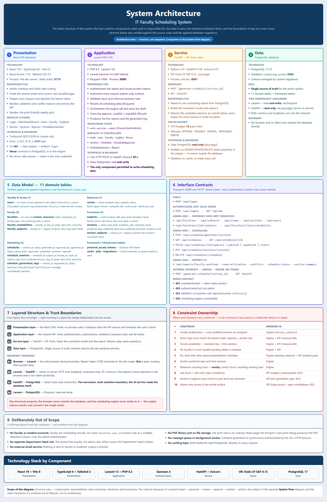

# Explainer — System Architecture

**Figure:** [`screenshots/15-system-architecture.png`](screenshots/15-system-architecture.png) — 1900 × 2917 px, 520 KB
**Editable source:** `.tmp-run/diagram/architecture.html` (not committed — a scratch file)
**Companion documents:** [`System-Architecture.md`](System-Architecture.md), [`Implementation_Status.md`](Implementation_Status.md)

*This file explains the architecture figure so you can present it and defend it. Every claim in it was checked against the code and the applied Laravel migrations.*

---

## 1. What this figure is

A single-page picture of the system's **static structure** — the parts it is made of, what each part is responsible for, the data each part owns, and the rules about what may talk to what.

It is deliberately **not** a sequence diagram. Nothing in it happens "first" or "next". It is the same picture whether the system is idle or serving a thousand requests, because structure does not change when the system runs.



---

## 2. The question it answers

> **"What is this system made of, and where does each responsibility live?"**

**It answers:**

- Which components exist and what technology implements each one
- What each component is responsible for
- Which component owns the data, and who is allowed to read or write it
- What the interfaces between the components are
- Which business rule is enforced where
- What the system deliberately does *not* include

**It does not answer:**

- What happens when the admin clicks a button (that is the **System Flow** figure)
- Which function or file implements a rule (that is the **Program Flow** figure)
- What the human does, screen by screen (that is the **User Flow** figure)

---

## 3. How to read it — element by element

### Cards 1–4 — the four runtime components

| # | Component | Implemented with | Runs on | Its one job |
|---|---|---|---|---|
| 1 | **Presentation** | React 19.2 · TypeScript 6.0 · Vite 8.1 · React Router 7.18 · Tailwind 4.3 | Port **5173** | Draws the admin interface and forwards the admin's intent |
| 2 | **Application** | PHP 8.3 · Laravel 13.8 · Sanctum 4.3 · Eloquent | Port **8000** | Authenticates, authorises, validates, and **owns all writes** |
| 3 | **Service** | Python 3.14 · FastAPI 0.139 · Uvicorn 0.51 · OR-Tools CP-SAT 9.15 · psycopg2 | Port **8001** | Builds and solves the constraint model; **writes nothing** |
| 4 | **Data** | PostgreSQL 17.10, database `scheduling_system` | Port **5432** | Single source of truth |

Each card lists the same three things, in the same order: **technology**, **responsibilities**, **interfaces and boundary**. Point this out — consistency is what makes the figure fast to read.

Two details worth reading aloud from the cards:

- Card 1 states plainly that the frontend **never connects to PostgreSQL or to the engine**. The browser has exactly one correspondent: Laravel.
- Card 3 states that the engine is **read-only** — and that this was verified by searching the whole engine for any write statement. That single sentence pre-empts the most likely challenge (see §7, caveat 1).

### Card 1 also shows the middleware chain and the 10 controllers

Card 2 lists the middleware chain — `auth:sanctum` → `admin` — and the ten controllers. That is the architecture of the API surface: every admin route passes through both guards before any controller code runs.

### Panel 5 — Data Model (11 domain tables)

The tables are grouped by *what they are for*, not alphabetically:

| Group | Tables | Purpose |
|---|---|---|
| Identity & Access | `users` | Who may log in — **admin only** |
| Faculty | `faculties`, `faculty_availabilities`, `faculty_subjects` | Who can teach, when, and what |
| Curriculum | `subjects`, `sections`, `section_subjects` | What is taught, to whom |
| Resources | `rooms` | Where it is taught |
| Scheduling | `schedules`, `schedule_sessions`, `schedule_generation_logs` | The output and its audit trail |

Plus the framework tables (`personal_access_tokens` for Sanctum, and `cache`, `jobs`, `migrations`), which are infrastructure rather than domain data.

If a panelist asks why `section_subjects` matters, this is the answer: it is the pivot table that stores *which subjects a section actually takes*, and it is what makes the "subjects must match the section's year level and semester" rule possible.

### Panel 6 — Interface Contracts

Every endpoint, grouped by access level, plus the error contract. This panel is what proves the architecture is real rather than aspirational — the endpoints named here exist in `backend/routes/api.php`.

### Panel 7 — Layered Structure and Trust Boundaries

Four layers (Presentation → Application → Service → Data) and four boundary crossings (B1–B4). The panel's value is that it names *where access narrows*:

- **B1** Browser ↔ Laravel — the only browser-facing boundary
- **B2** Laravel → FastAPI — server-to-server, no token
- **B3** FastAPI → PostgreSQL — read-only, and the narrowest boundary in the system
- **B4** Laravel ↔ PostgreSQL — read **and write**

The boxed "key structural property" at the bottom is the sentence to say out loud: *the browser never reaches the database, and the engine never writes to it.*

### Panel 8 — Constraint Ownership

All ten business rules and where each is enforced. Read the "Enforced in" column as the important one: rules appearing in **two** places (engine **and** API) are deliberate defence in depth — the solver gets it right at generation time, and the manual-edit validator catches a human who tries to break it afterwards.

### Panel 9 — Deliberately Out of Scope

Six things confirmed absent from the code: no faculty/student accounts, no separate Department Head role, no email service, no PDF library or file storage, no queue or background worker, no caching layer. This panel exists so nobody has to guess whether an omission was an oversight.

---

## 4. Where it goes

| Destination | How to use it |
|---|---|
| [`System-Architecture.md`](System-Architecture.md) | This is the figure for that document. Insert it at the top of the document, or beside the component-inventory section. The document is the prose; this figure is the one-page summary of it. |
| [`Implementation_Status.md`](Implementation_Status.md) | Cites the 11-table schema and the component list — the figure matches. |
| Manuscript | The chapter on **system design / architecture**. This is the "system architecture" figure; do not confuse it with the flow figures. |
| [`System_Defense_Guide.md`](System_Defense_Guide.md) | Use it as the opening visual of the defense — it establishes the vocabulary (component names, layer names) every later figure depends on. |
| Hearing order | **Open with this one.** It gives the panel the map before you show them any movement. |

> **Note:** none of the markdown documents currently embed figure `15`. `Program-Flow.md` is the only document that cites a figure at all (it cites the older `11-program-flow.png`). If you want the document and the figure to point at each other, the cross-reference has to be added.

---

## 5. Sixty-second spoken script

> "This is the architecture of the system — what it's made of, not what it does.
>
> There are four components. The **React frontend** on the left is the admin interface; it holds no domain rules, it only draws screens and forwards what the admin asks for. The **Laravel API** in the middle is where the system actually lives — authentication, authorisation, every validation rule, and every database write. On the right is the **AI engine** — a Python FastAPI service running OR-Tools CP-SAT — and at the far right is **PostgreSQL**, the single source of truth.
>
> The important line in this diagram is the boundary. The browser talks **only** to Laravel — it never touches the database and it never talks to the AI engine. The AI engine is called server-to-server by Laravel, and it **reads** the scheduling data itself but **writes nothing** — the result goes back to Laravel and Laravel saves the draft. So there is exactly one writer.
>
> The lower half shows the eleven tables grouped by purpose, the full endpoint inventory, and the ten business rules with the component that enforces each one. The last panel lists what we deliberately left out — no faculty logins, no email service, no PDF library — so nothing here is an accidental omission."

---

## 6. Likely panelist questions

**"Why does the AI engine read the database directly instead of receiving the data from Laravel?"**
Because the engine needs the current state of many tables — the section, its subjects, qualified faculty, their declared availability, existing committed load, and available rooms. Having Laravel assemble and serialise all of that would duplicate an entire data-access layer in PHP, and the two copies could drift. Reading it directly keeps one definition of "the scheduling inputs". The trade-off — and it is a real one — is that the engine now depends on the database schema, which is stated openly on the figure.

**"Isn't it a security problem that the AI service has database access?"**
It has **read-only** access in practice: there is no `INSERT`, `UPDATE`, `DELETE`, or commit anywhere in the engine's codebase. The connection is over loopback, server-to-server, and the service is never exposed to the browser or to the network. The figure states this on card 3 so the property is visible, not assumed.

**"Why four components instead of one Laravel application that also solves the schedule?"**
Because the solver is Python — OR-Tools' CP-SAT is the constraint-programming library the project is built on, and the alternative would be reimplementing it in PHP. Separating them also means the solver can be tested as a pure function: the engine's 118 tests call `generate_schedule()` directly with structured data and no HTTP or database involved.

**"What happens if the AI engine is down?"**
Laravel catches the connection failure, writes a failure row to the generation log, and returns HTTP 502. No draft is created, so the admin never sees a half-built schedule. This is covered in detail in the **System Flow** explainer.

**"Where is the business logic?"**
Almost entirely in the Laravel layer — card 2. The solver enforces the scheduling constraints, but the data-integrity rules — lab-hour consistency, subject-to-section matching, the publish conflict gate — are application-layer rules that never reach the solver. Panel 8 maps all ten.

**"Why is there no separate Department Head role?"**
The SRS lists Administrator and Department Head as two user classes, but the implemented system issues a single `admin` login role that covers both — the Department Head signs in with the administrator account. This is a documented simplification, not an oversight. Be ready to state it plainly rather than let it be found.

**"What technology is each part written in?"**
Read from the four cards, or from the technology strip at the foot of the figure. Answer with versions — PHP 8.3, Laravel 13.8, React 19, FastAPI with OR-Tools CP-SAT 9.15, PostgreSQL 17 — it shows the stack is real and pinned.

**"What stops bad data from getting into the system?"**
Five layers, and the figure shows three of them. The solver enforces the scheduling constraints at generation time; the manual-edit checker re-validates every admin edit server-side; and the publish conflict gate runs a final cross-section check before a schedule goes live. The fourth is the **term-scoped generation lock plus the pre-write conflict gate**, also not drawn here: one generation run per academic year and semester at a time (`409` when contended), with the engine's plan cross-checked against that term's other `draft`/`approved`/`published` sessions before anything is written (`422` on a clash). The fifth is the **published-reference guard**: deleting a faculty, subject, room or section record that a published schedule still depends on is refused with **409** and the exact scope of the loss, and only an explicit `?force=1` proceeds. Layers 1–3 protect a schedule while it is being built; layer 4 keeps two runs from building clashing ones; layer 5 protects one that has already been distributed. The full sequence is in `System-Architecture.md` § 2.1 and § 2.10.

---

## 7. Accuracy notes and honest caveats

Read these before the hearing so nothing on the figure surprises you.

1. **The direct database read by the AI engine is the one genuine architectural challenge.** The figure shows it honestly (boundary **B3**, card 3, and the footnote). If the panel's requirement is that no service may touch the database directly, the compliant alternative is for Laravel to send the scheduling data in the request body instead. That would be a design change, not a documentation change — say so if asked, rather than promising it on the spot.

2. **`faculties.user_id` is nullable and detached.** Faculty are records, not users. The column survives only as an optional legacy link; the faculty member's name is stored directly on the record. Do not describe the system as having faculty accounts.

3. **`schedules.status` is a plain string column, not a database enum.** The values `draft`, `approved`, `published`, `archived`, `rejected` are enforced by controller logic. If someone inspects the migration expecting a PostgreSQL `ENUM`, they will not find one.

4. **Do not present `database/schema.sql` as the current schema.** That file is explicitly marked *"HISTORICAL — DO NOT RUN"*. It disagrees with the live database — it still shows a `department_head` role, a singular `faculty_availability` table, and `academic_years`/`semesters` tables that were never migrated. The eleven tables on this figure come from the applied migrations, which are the authority.

5. **One faculty type is unreachable.** The database enum accepts `full_time`, `part_time`, and `evening`, and the figure reports that accurately — but the API's validation only accepts the first two, and the UI only offers the first two. So `evening` cannot currently be set through the system. It is a harmless dead value, but know about it before someone asks "do you support evening classes?"

6. **The engine's runtime dependencies are not pinned in `requirements.txt`.** FastAPI, Uvicorn, and psycopg2 are installed in the project's virtual environment but are missing from that file, so a fresh install following the documented steps would not start the engine. The versions printed on card 3 reflect the environment that actually runs, not the requirements file.

7. **The figure shows three of the five protection layers.** Panel 8 maps the ten business rules that the solver and the API enforce — the solver's own constraints, manual-edit validation, and the publish conflict gate. Two layers sit outside that panel's scope: the **generation-time conflict gate and term lock** (`ScheduleController`, described in `System-Architecture.md` § 2.1), and the **published-reference guard**, which is a *delete-time* rule rather than a scheduling rule and is documented in § 2.10. Both are real and tested (`ScheduleGenerationConflictTest`, `PublishedReferenceGuardTest`) — but if you list "three protection layers" while presenting this figure, name the other two out loud rather than letting the count imply they do not exist. Note also that on `?force=1` the affected published schedule keeps its `published` status and the removal is not recorded anywhere — see § 2.10 for the exact consequences.

---

## 8. Regenerating the figure

The figure is rendered from a local HTML file, so it can be edited and re-shot without any diagramming tool:

```bash
# 1. Edit the source, then measure the page size in a browser:
#    open .tmp-run/diagram/architecture.html  and evaluate
#    document.body.scrollWidth / scrollHeight

# 2. Screenshot at exactly that size:
"/c/Program Files (x86)/Microsoft/Edge/Application/msedge.exe" \
  --headless=new --disable-gpu --no-first-run --hide-scrollbars \
  --user-data-dir="$(mktemp -d)" \
  --window-size=1900,2917 \
  --screenshot="documentation/screenshots/15-system-architecture.png" \
  "file:///<repo>/.tmp-run/diagram/architecture.html"
```

The `--window-size` **must** match the measured page size, or the capture will clip the figure. The current figure is 1900 × 2917.

---

## 9. How this view relates to the other three

| View | Figure | Answers |
|---|---|---|
| **Architecture** | [`15-system-architecture.png`](screenshots/15-system-architecture.png) ← *you are here* | What is the system made of? |
| System Flow | [`16-system-flow.png`](screenshots/16-system-flow.png) · [explainer](Explainer-System-Flow.md) | What happens between components when it runs? |
| Program Flow | [`17-program-flow.png`](screenshots/17-program-flow.png) · [explainer](Explainer-Program-Flow.md) | What code runs, and where is each rule enforced? |
| User Flow | [`14-user-flow-modern.png`](screenshots/14-user-flow-modern.png) · [explainer](Explainer-User-Flow.md) | What does the admin do, step by step? |

Quick test for which view you are looking at: if an arrow could be labelled with a **URL or a port**, it is a flow view. If a box could be labelled with a **filename or function name**, it is program flow. If boxes are **components and tables**, it is architecture.
