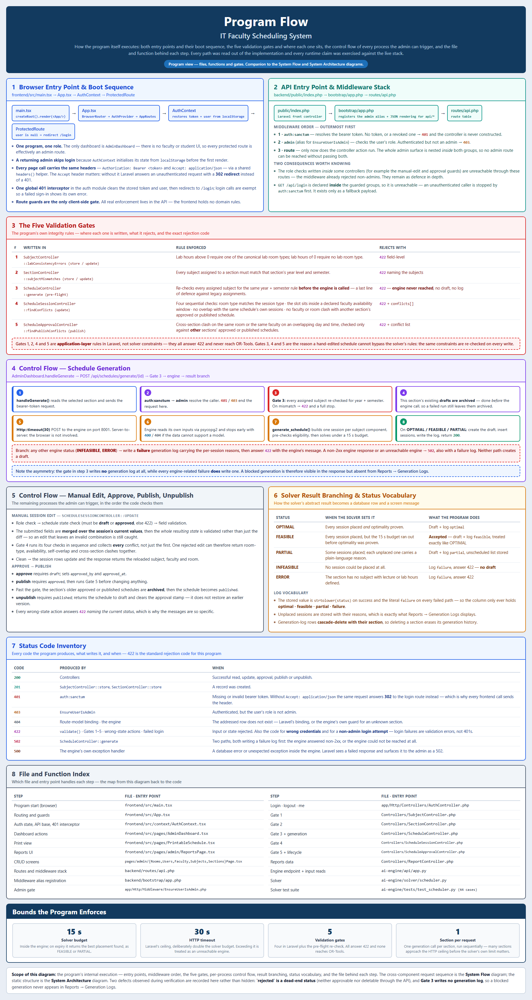

# Explainer — Program Flow

**Figure:** [`screenshots/17-program-flow.png`](screenshots/17-program-flow.png) — 1900 × 3832 px, 650 KB
**Editable source:** `.tmp-run/diagram/program-flow-v2.html` (not committed — a scratch file)
**Companion documents:** [`Program-Flow.md`](Program-Flow.md), [`Explainer-System-Flow.md`](Explainer-System-Flow.md)

*This file explains the program flow figure so you can present it and defend it. Every gate, status code, and branch was read out of the implementation; the runtime claims were exercised against the running stack.*

---

## 1. What this figure is

A picture of how the **program itself executes** — what runs first, which file and function handles each step, where each validation gate sits, and what each code path returns.

This is the view a panelist asks for when they say *"show me where that rule is enforced."* The architecture figure answers *what the parts are*; the system flow figure answers *what happens between them*; this one answers **what code actually runs**.



---

## 2. The question it answers

> **"Which file, which function, and in what order — and where is each rule enforced?"**

**It answers:**

- Where both programs start executing, and their boot sequence
- The middleware stack and the exact order it runs in
- The five validation gates, with the file and method for each
- The control flow of every process the admin can trigger
- How the solver's abstract result becomes a database row
- Every status code the program can produce, and what writes it
- A file-and-function map from each step back to the source

**It does not answer:**

- What the system is made of, statically (**System Architecture**)
- The cross-component request sequence (**System Flow**)
- What the human sees on screen (**User Flow**)

---

## 3. How to read it — section by section

### Section 1 — Browser Entry Point and Boot Sequence

The chain is drawn literally: `main.tsx` → `App.tsx` → `AuthContext` → `ProtectedRoute`.

The three points to make:

1. **`main.tsx` mounts `App`**, which wraps the routes in `BrowserRouter` and `AuthProvider`.
2. **`AuthContext` restores `token` and `user` from `localStorage`** before first render — that is why a returning admin skips the login screen.
3. **`ProtectedRoute` is the only client-side guard.** It redirects to `/login` when there is no user in context. The frontend holds no domain rules; all enforcement is server-side.

This is also where the figure notes that every page call sends `Accept: application/json` — and **why it matters**. Without that header, Laravel answers an unauthenticated request with a **302 redirect** instead of a 401. That single header is what makes the API behave like an API.

### Section 2 — API Entry Point and Middleware Stack

`public/index.php` → `bootstrap/app.php` → `routes/api.php`. `bootstrap/app.php` is where the `admin` middleware alias is registered and where JSON rendering is forced for `api/*`.

The middleware order is the important part, because it determines which code ever runs:

1. **`auth:sanctum`** — resolves the bearer token. Missing or invalid → **401**, and the controller is **never constructed**.
2. **`admin`** (alias for `EnsureUserIsAdmin`) — checks the role. Authenticated but not admin → **403**.
3. **The controller action** — only now.

Two consequences the figure states explicitly, both of which are good things to be able to say:

- **The role checks written inside some controllers are unreachable** through these routes, because the middleware already rejected non-admins. They remain as defence in depth — a second layer in case a route is ever added outside the guarded group.
- **`GET /api/login` is unreachable.** It is declared *inside* the `auth:sanctum` + `admin` groups, so an unauthenticated caller is stopped by the guard before the closure runs. It exists only as a fallback payload.

### Section 3 — The Five Validation Gates

The centrepiece. Each gate with its file, its method, its rule, and its rejection code:

| Gate | Written in | Rule | Rejects with |
|---|---|---|---|
| **1** | `SubjectController::labConsistencyErrors` | Lab hours above 0 require a canonical lab room type; lab hours of 0 require none | 422 |
| **2** | `SectionController::subjectMismatches` | Assigned subjects must match the section's year level and semester | 422 |
| **3** | `ScheduleController::generate` (pre-flight) | Re-checks the same rule **before the engine is called** | 422 — engine never reached |
| **4** | `ScheduleSessionController::findConflicts` | Room type · faculty availability window · same-schedule overlap · cross-section faculty/room clash | 422 + `conflicts[]` |
| **5** | `ScheduleApprovalController::findPublishConflicts` | Cross-section clash on room or faculty | 422 + conflict list |

The dashed callout box under the table is the sentence to deliver: **Gates 1, 2, 4 and 5 are application-layer rules in Laravel, not solver constraints — they all answer 422 and never reach OR-Tools.** That distinction (what the solver enforces versus what the application enforces) is exactly the sort of thing a panel probes.

Gates 3, 4 and 5 together are why a hand-edited schedule cannot bypass the solver's rules — the same constraints are re-checked on every write.

A sixth checkpoint is drawn beneath the table but is **not** one of the five gates: `AdminDashboard.handleGenerate` asks for **confirmation** when the section already has a draft, approved or published schedule. It is a misclick guard, not a rule — it returns no status code, and a direct API call is still accepted.

### Section 4 — Control Flow: Schedule Generation

Seven numbered steps followed by both branch outcomes. Two things to point at. **Step 1** is the confirmation prompt: if the section already has a draft, approved or published schedule, the UI names what would be replaced *before* sending anything — cancelling sends no request. **Step 7** is the ordering rule: the section's previous draft is archived **only after** the engine returns a usable result, never before the call.

That ordering is worth volunteering as a fixed defect. Archiving up front (the earlier behaviour) meant a failed or infeasible run replaced the draft with *nothing*, so a transient engine outage silently destroyed the admin's work. Now a **422** or **502** leaves the existing draft untouched — a failed attempt is retryable rather than destructive.

The blue callout under it records an asymmetry worth volunteering: **the pre-flight gate writes no generation log at all, while every engine-related failure does.** A blocked generation is visible in the response but absent from Reports → Generation Logs.

### Section 5 — Manual Edit, Approve, Publish, Unpublish

In the order the code checks them. The manual-edit subsection is the one to explain carefully: the submitted fields are **merged over the session's current values**, and then the *whole resulting state* is validated rather than just the diff. Gate 4 collects **every** conflict rather than stopping at the first — which is why one rejected edit can report a room-type problem, an availability problem, a self-overlap, and a cross-section double-booking all at once.

Also note that every wrong-state action answers **422 while naming the current status** — *"Only approved schedules can be published. This schedule is currently 'published'."* That specificity comes from the code, not from a generic error handler.

### Section 6 — Solver Result Branching and Status Vocabulary

How the solver's abstract result becomes a database row and a screen message. The five statuses are covered, including the counter-intuitive one: **`FEASIBLE` is accepted**, not rejected. The solver hit its 15 s budget but placed every session, so it is stored exactly like `OPTIMAL`.

The log vocabulary subsection states that the stored value is `strtolower(status)` on success and the literal `failure` on every failed path — so the column only ever holds **`optimal · feasible · partial · failure`**. Also worth knowing: generation-log rows **cascade-delete with their section**, so deleting a section erases its generation history.

### Section 7 — Status Code Inventory

Every code, its producer, and when it fires. Two entries deserve emphasis:

- **422 is the standard rejection code for this program — but not for login.** A failed login answers
  **401** for a wrong password or an unknown email, and **403** for a valid non-admin account; a 422
  from this route means only a malformed body.
- **401 vs 302 depends on the `Accept` header.** Same request, different answer. This is the kind of detail that signals the system was actually exercised.

### Section 8 — File and Function Index

The map from each step back to the source. This is the panel-ready answer to *"where is that implemented?"* — and it doubles as evidence that the figure was derived from the code rather than sketched from memory.

### Bounds strip

**15 s** solver budget · **30 s** HTTP timeout · **5** validation gates · **1 section per request**, run sequentially with no batch endpoint.

---

## 4. Where it goes

| Destination | How to use it |
|---|---|
| [`Program-Flow.md`](Program-Flow.md) | The prose companion. That document already traces the same behaviour file by file — this figure is its visual summary. |
| [`System_Defense_Guide.md`](System_Defense_Guide.md) | Use it for the **"where is this enforced?"** part of the defense. Panel 3 answers it directly. |
| Manuscript | The chapter on **implementation / system logic**. Pair it with the system flow figure: one for behaviour, one for code. |
| Code appendices | Panel 8 works as a compact index if you are asked to walk the source. |
| Hearing order | **Third.** By now the panel knows the parts and the behaviour; this shows the code behind both. |

> **Superseded figure:** `screenshots/11-program-flow.png` (2600 × 9038, rendered from `program-flow.mmd`) is the earlier Mermaid version of this view. Three documents still cite it by name — `Program-Flow.md` (line 79), `Progress-report.md` (line 64), and `Manuscript_Update_Brief.md` (line 97). If you adopt this figure for the manuscript, update those three citations so the documents and the figures agree.

---

## 5. Sixty-second spoken script

> "This figure shows how the program actually executes — which file, which function, in what order.
>
> Both programs have an entry point. The browser starts at `main.tsx`, which mounts the app, and `AuthContext` restores the session from local storage, so a returning admin skips login. The API starts at Laravel's front controller, which loads `bootstrap/app.php` — that is where the `admin` middleware is registered — and then the route table.
>
> The middleware runs in a fixed order: `auth:sanctum` first, then the admin role check, and only then the controller. That is why a request with no token gets a 401 and never even reaches the controller code.
>
> The middle panel is the part I'd emphasise. The program has **five validation gates**, and each one's file and method is named here. Four of them are application-layer rules in Laravel, not solver constraints — they all answer 422 and never reach OR-Tools. Gate 4 is what protects manual edits: it re-checks the same rules the solver used at generation time, so a human cannot edit a schedule into an invalid state.
>
> The bottom panels give the solver result branching, every status code the program can produce, and a file-and-function index mapping each step back to the source."

---

## 6. Likely panelist questions

**"Where exactly is the subject-to-section rule enforced?"**
In three places, deliberately: `SectionController` prevents you assigning a mismatched subject; `ScheduleController::generate` re-checks before calling the engine; and the Sections page filters its subject checklist to matching subjects so the admin is guided rather than corrected. All three answer 422.

**"If I edit a schedule by hand, do the solver's rules still apply?"**
Yes. Gate 4 merges your change onto the session's current values and then validates the full resulting state against four checks: room type, faculty availability, same-schedule overlap, and cross-section faculty/room clashes. It reports **all** conflicts it finds, not just the first.

**"What is the difference between the solver's constraints and your validation gates?"**
The solver enforces the *scheduling* constraints — no double-booking, room type and capacity, qualification, availability, section preferences, maximum teaching load. The gates enforce *data-integrity* rules at the application layer — lab-hour consistency, subject/section matching, the publish conflict check. The gates never reach OR-Tools.

**"How many tests do you have?"**
Two suites. The AI engine has **118 unit tests** across five modules that call `generate_schedule()` directly with structured data and no HTTP or database involved — which is possible because the solver is a pure function. The Laravel side has **143 tests / 604 assertions** covering the feature endpoints, including the conflict payload, the term lock and pre-write conflict gate, and the 401 contract. Both suites pass.

**"Why does the engine's input reading live in `app.py` rather than in the solver?"**
Separation of concerns. `app.py` handles HTTP and data access; `scheduler.py` contains no HTTP code at all and is a pure function — data in, data out. That is what makes the 118 solver tests fast and deterministic.

**"Show me how a login failure is handled."**
`AuthController::login` distinguishes the failures rather than reporting them all as validation
errors. An unknown email or a wrong password answers **401** with
`{"message":"The provided credentials are incorrect."}` — an authentication failure, not a bad
field. Valid credentials on a non-admin account answer **403** with
`Only administrator accounts can access this system.`, so no token is ever issued. Only a malformed
body is still **422**, from `validate()`. The 401 that `auth:sanctum` produces on a later request is a
separate path.

**"What does the app do if someone tries an admin action without admin rights?"**
`EnsureUserIsAdmin` returns **403** before any controller runs. In practice no non-admin accounts exist, so this is defence in depth — but it is enforced and tested.

---

## 7. Accuracy notes and honest caveats

1. **`rejected` is a dead-end status.** `reject` sets a draft to `rejected`, but the delete rule accepts only `draft` and `archived`, and approve/publish require their own prior states. A rejected schedule therefore **cannot be approved, published, or deleted through the API**. The figure records this. The fix is to accept `rejected` in the delete path (or add a way back to `draft`).

2. **The pre-flight gate writes no generation log.** Every engine-related failure writes a failure row; a generation blocked by the subject/section mismatch writes nothing, so it never appears in Reports → Generation Logs. Documented on the figure.

3. **`GET /api/login` is declared inside the guarded middleware groups**, which makes it unreachable. It is a fallback payload, not a live route. If you are asked why there are two login paths, this is the answer.

4. **The in-controller role checks are unreachable via the routes.** `ScheduleSessionController` and `ScheduleApprovalController` both re-check the role, but the middleware already rejected non-admins. Frame this as defence in depth, not redundancy.

5. **Login failures are 401 or 403, not 422** — worth stating before a panelist assumes otherwise.
   A wrong password and an unknown email answer **401**; a valid non-admin account answers **403**;
   a 422 from this route means only a malformed body.

6. **`schedules.status` is a plain string**, not a database enum. The accepted values are enforced by controller logic. A `rejected` value can exist in the column even though it appears in no documented lifecycle.

7. **One faculty type cannot be set.** The database enum accepts `evening`, but the API validation and the UI accept only `full_time` and `part_time` — so that enum branch is unreachable. Harmless, but know it if evening-class support comes up.

---

## 8. Regenerating the figure

```bash
# 1. Edit .tmp-run/diagram/program-flow-v2.html
# 2. Open it in a browser and read document.body.scrollWidth / scrollHeight
# 3. Screenshot at exactly that size:
"/c/Program Files (x86)/Microsoft/Edge/Application/msedge.exe" \
  --headless=new --disable-gpu --no-first-run --hide-scrollbars \
  --user-data-dir="$(mktemp -d)" \
  --window-size=1900,3832 \
  --screenshot="documentation/screenshots/17-program-flow.png" \
  "file:///<repo>/.tmp-run/diagram/program-flow-v2.html"
```

`--window-size` must equal the measured page size or the capture clips. The current figure is 1900 × 3832. The output path must be **absolute** — Edge resolves a relative `--screenshot` path against its own working directory and silently fails to write.

---

## 9. How this view relates to the other three

| View | Figure | Answers |
|---|---|---|
| Architecture | [`15-system-architecture.png`](screenshots/15-system-architecture.png) · [explainer](Explainer-Architecture.md) | What is the system made of? |
| System Flow | [`16-system-flow.png`](screenshots/16-system-flow.png) · [explainer](Explainer-System-Flow.md) | What happens between components when it runs? |
| **Program Flow** | [`17-program-flow.png`](screenshots/17-program-flow.png) ← *you are here* | What code runs, and where is each rule enforced? |
| User Flow | [`14-user-flow-modern.png`](screenshots/14-user-flow-modern.png) · [explainer](Explainer-User-Flow.md) | What does the admin do, step by step? |

Quick test for which view you are looking at: if an arrow could be labelled with a **URL or a port**, it is a flow view. If a box could be labelled with a **filename or function name**, it is program flow. If boxes are **components and tables**, it is architecture.
