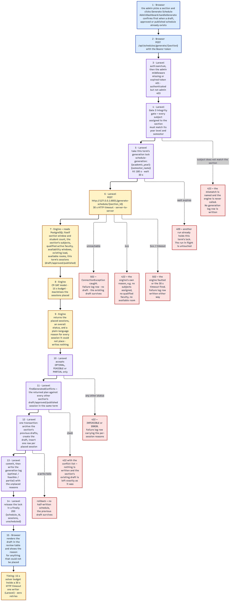

# Explainer — System Flow

**Figure:** [`screenshots/16-system-flow.png`](screenshots/16-system-flow.png) — 2531 × 6600 px, 604 KB
**Editable source:** [`screenshots/system-flow.mmd`](screenshots/system-flow.mmd) — committed Mermaid, rendered with the Mermaid CLI (§8)
**Companion documents:** [`Program-Flow.md`](Program-Flow.md), [`API.md`](API.md), [`Explainer-Architecture.md`](Explainer-Architecture.md)

*This file explains the system flow figure so you can present it and defend it. Steps, status codes, and every failure branch were traced through the code and exercised against the running stack.*

---

## 1. What this figure is

A picture of the system's **runtime behaviour** — the ordered sequence of interactions that happens when the admin triggers something, the decisions taken at each step, the data that moves, and the exact branch every failure takes.

Where the architecture figure shows *parts*, this one shows **movement**. Every step is numbered in execution order and tagged with the component that performs it, so you can trace a request from the browser to the database and back.



---

## 2. The question it answers

> **"What happens, in what order, when someone uses this system — and what happens when it fails?"**

**It answers:**

- The sequence of steps for the system's core operation (generating a schedule)
- Which component performs each step
- What data moves at each hand-off
- Every way the generation flow can end early, and what the system returns
- Where the term lock sits, and what it protects
- When the previous draft is archived, and why that cannot destroy the admin's work

**It does not answer:**

- What the system is made of, statically (that is the **System Architecture** figure)
- Which file or function implements a step (that is the **Program Flow** figure)
- What the human sees on screen (that is the **User Flow** figure)
- How a draft becomes a published, printed schedule — that path is *not drawn in this figure*; it is in §3.4 below, and it is the subject of the **User Flow** figure

---

## 3. How to read it — section by section

### Section 1 — Primary flow: generating and replacing a draft (15 numbered steps)

This is the heart of the figure. Steps are colour-coded by actor, which lets you show the hand-offs at a glance:

| Actor | Steps | What it does |
|---|---|---|
| **Browser** (blue) | 1, 2, 15 | Starts the request; renders the result |
| **Laravel** (purple) | 3, 4, 5, 10, 11, 12, 13, 14 | Guards and validates, takes the term lock, calls the engine, cross-checks the plan, persists the replacement inside one transaction, releases the lock |
| **Engine** (amber — FastAPI + OR-Tools CP-SAT) | 6, 7, 8, 9 | Reads PostgreSQL itself, solves under a 15 s budget, reports a reason for every session it could not place |
| **PostgreSQL** (green) | inside 7 and 12 | Supplies the six read sets the engine performs, and the rows Laravel commits |

The shape to narrate: **Laravel hands off, the engine reads for itself, and the result comes back to Laravel.** Notice that the engine's reads are the engine reading PostgreSQL **directly**, server-to-server, rather than receiving the data from Laravel. That distinction is the figure's most important structural claim.

**The execution order is the point of this figure — four details are easy to get wrong, and all four are drawn correctly here:**

1. **Gate 3 runs before the lock.** A subject/section mismatch is refused with 422 without ever taking the lock and without calling the engine.
2. **The lock is held across the whole run** — the engine call, the conflict check and the write — so two sections in one academic term cannot both read the pre-run snapshot.
3. **The returned plan is cross-checked before anything is written.** `findGeneratedConflicts` measures it against every *other* section's draft, approved and published sessions in the same term; a clash is a 422 and the section's existing draft is left exactly as it was.
4. **The previous draft is archived inside the same transaction that creates its replacement.** Archiving up front (the older behaviour) let a failed or clashing run destroy the admin's work; the archive, the new draft and its sessions now commit or roll back together.

Step 6 is where the 30 s HTTP timeout lives; step 8 is where the 15 s solver budget lives. The amber timing strip at the foot of the chain states both, plus the two invariants: **one writer** (Laravel) and **zero retries**.

### Section 2 — Every way this flow ends early (8 branches)

Each failure branch is drawn beside the step that can produce it, so you can read the condition, the component that detects it, the response code, and the side effect in one glance.

The rows worth knowing by heart:

| Situation | Who detects it | Result | Side effect |
|---|---|---|---|
| Subject does not match the section's year/semester | Laravel (Gate 3) | **422** naming the subjects | The engine is **never called** and **no log row** is written |
| Another run already holds this term's lock | Laravel (cache lock) | **409** | The run in flight is untouched |
| Engine not running / port closed | Laravel HTTP client | **502** | `failure` log row written; **no draft**; the existing draft survives |
| Engine answers 4xx (no subjects, no qualified faculty, no available room) | Engine → Laravel | **422** with the engine's own reason | `failure` log row written |
| Engine answers 5xx, or the 30 s timeout fires | Laravel HTTP client | **502** | `failure` log row written either way |
| Engine places nothing (INFEASIBLE) or errors | Solver → Laravel | **422** with the engine's message | `failure` log row carrying the per-session reasons |
| Plan clashes with another section in the same term | Laravel (`findGeneratedConflicts`) | **422** with the conflict list | Nothing is written; the existing draft is left as it was |
| A write inside the transaction fails | PostgreSQL / Laravel | rollback | No half-written schedule; the previous draft survives |

If you only present one part of this figure, present these branches: they show that failures were designed for rather than discovered.

### Authentication flow — *prose only; not drawn in the figure*

Login, token issuance, and the 401 path. Three points to make:

1. **Login is the only public route.** Everything else sits behind `auth:sanctum`.
2. **A failed login is a 401, not a 422.** A wrong password and an unknown email both answer **401**;
   a valid non-admin account answers **403**. A 422 from this route means only a malformed body.
   Getting this right is a good sign you actually tested the system.
3. **A 401 anywhere is handled globally.** A single interceptor clears the stored session and redirects to the login page — so an expired token never leaves a page silently showing empty data.

### Review, edit, approve, publish, print — *prose only; not drawn in the figure*

What happens to a draft between generation and paper. The manual-edit subsection matters most, because it describes **four sequential conflict checks** and notes that the change is merged onto the session's existing values and the *whole resulting state* is re-validated — not just the fields that were sent. That is why a partial edit cannot smuggle in an invalid combination.

The print subsection states plainly that PDF is produced by the **browser's own print dialog** — there is no PDF library and no external service.

### Schedule lifecycle — *prose only; not drawn in the figure*

State chips with the real triggering events. Two things here are more accurate than a typical student diagram:

- **`ARCHIVED` is not the step after `PUBLISHED`.** Archiving happens two ways: regenerating a section archives its old drafts, and publishing a *new* schedule archives the previously published one for that section. A schedule does not archive itself.
- The status list explicitly records that **`rejected` is a dead end**. More on that in §7.

### Faculty availability and concurrency — *prose only; not drawn in the figure*

How availability is authored, and what happens when two things run at once. Key facts:

- Saving availability **replaces** the whole set — old rows are deleted, new ones inserted. It is not a merge.
- A row only means anything when **both** start and end times are present; a row with a missing time is ignored by the engine, so an empty window silently imposes no restriction.
- A faculty member with **no** declared availability at all falls back to the section's preferred days; one **with** declared windows is restricted to exactly those.
- Generation is **synchronous**. There is no queue, no worker, and no retry. The admin waits.
- A run affects other sections as soon as it is a **draft**: `draft`, `approved` and `published` sessions in the same academic year and semester all count as live bookings for the next run. Generation for one term is serialized by a cache lock, so a run cannot read a pre-run snapshot that another in-flight run is about to change.

---

## 4. Where it goes

| Destination | How to use it |
|---|---|
| [`API.md`](API.md) | The endpoint-level reference. This figure is the behaviour those endpoints produce. |
| [`Program-Flow.md`](Program-Flow.md) | The prose companion — the same behaviour described file by file, with the identical generation flowchart in §3.2. Reference this figure as the visual summary. |
| Manuscript | The chapter on **system operation / methodology**. This is the figure that shows the pipeline actually working. |
| [`System_Defense_Guide.md`](System_Defense_Guide.md) | Present it **second**, immediately after the architecture figure. Architecture establishes the parts; this shows them moving. The guide carries its own copy of the generation flow in §Flow 1. |
| Hearing order | **Second.** Walk steps 1–15 down the chain, then pick two or three of the failure branches to highlight. |

> **Superseded figure:** `screenshots/12-system-flow.png` (1860 × 1829) is an earlier rendering of the same view in a different style. This figure is the print-quality one. `12` is not cited by any markdown document, so there is no broken reference either way — but avoid using both in the same document.

---

## 5. Sixty-second spoken script

> "This is what happens when the admin generates a schedule.
>
> It starts at the browser — step 1 — where the admin picks a section and clicks generate. The request goes to Laravel, which first checks the token, then the role. Step 4 is a data-integrity gate: every subject assigned to that section must match the section's year level and semester. If not, Laravel answers 422 and **never calls the AI engine at all** — so bad data can't waste a solve, and it doesn't even take the lock.
>
> Step 5 is the term lock. Generation for one academic year and semester runs one section at a time; a second request for the same term waits, and answers 409 if its wait expires. That lock is what stops two runs from each reading the database before the other's draft existed — which is how two sections used to be handed the same faculty member.
>
> Step 6 is the engine call. Notice steps 7 to 9 — those reads are the engine reading PostgreSQL **itself**, server-to-server. It solves under a 15-second budget and returns every session it could not place with a plain-language reason. It writes nothing; Laravel is the only writer in the system.
>
> Then step 11: the returned plan is cross-checked against every other section's draft, approved and published sessions in the same term. A clash is a 422 and **nothing is written** — the section's previous draft is left exactly as it was. Only after that does step 12 open one transaction that archives the old draft, creates the replacement and inserts its sessions, so a failed write rolls the whole thing back instead of leaving a half-written schedule.
>
> The branches beside the chain are the failure paths. Every one is enumerated with its status code and its side effect. An unreachable engine is a 502 with a failure log. A solver that can't place everything is a **partial success** — we save the draft and report the sessions it couldn't place, rather than throwing the whole run away."

---

## 6. Likely panelist questions

**"What happens if the AI engine crashes mid-request?"**
Laravel catches the connection failure, writes a failure row to the generation log with the connection error, and returns HTTP 502. No draft is created, and the section's previous draft is left untouched.

**"What if the solver can't find a complete schedule?"**
It never fails silently. It maximises the number of sessions it can place, returns `PARTIAL`, and supplies a **plain-language reason for every session it could not place** — for example, "no room of type 'computer_lab' exists for this laboratory session." That is saved as a draft and shown to the admin, who fixes the data and regenerates.

**"Why is the solver limit 15 seconds but the HTTP timeout 30?"**
Deliberate headroom. The solver stops itself at 15 seconds and returns the best answer it found. The 30-second HTTP timeout means the outer request will not time out before the inner solve has had a chance to finish and report.

**"How do you stop two people scheduling the same room?"**
Layered, not one mechanism. At generation time the solver treats every other section's **draft**, approved and published sessions in the same term as hard constraints, Laravel serializes runs for a term behind a lock (409 when contended) and cross-checks the generated plan before writing it (422 on a clash). A manual edit is re-checked by the conflict validator, drafts in the same term included. And publishing runs a cross-section conflict gate that refuses with 422 if the new schedule clashes with another section's live schedule.

**"Is a draft visible to faculty?"**
No. Only `published` schedules are printed and distributed. Drafts and approved schedules are internal.

**"What happens if the engine takes too long?"**
Laravel's 30-second client timeout fires, which is treated exactly like an unreachable engine: a failure log is written and a 502 is returned.

**"Can a schedule be edited after publishing?"**
Not directly. A published schedule must be **unpublished** first, which returns it to draft and clears the approval stamp; then it can be edited, approved, and published again. That two-step is intentional — it prevents silent changes to a schedule that has already been distributed.

---

## 7. Accuracy notes and honest caveats

1. **`rejected` is a dead-end status in practice.** `reject` sets a draft's status to `rejected`; approve and publish require their own prior states, so a rejected schedule cannot be approved or published. It can be deleted (the delete rule is "anything except `published`"), but it cannot be reactivated — it can only be discarded. If asked, say it is a known gap and that the fix is a reactivation path.

2. **The pre-flight gate writes no generation log.** Every engine-related failure writes a failure row, but a generation blocked by the subject/section mismatch writes **nothing**. That means a blocked generation is visible in the HTTP response but does **not** appear in Reports → Generation Logs. This asymmetry is drawn on the figure.

3. **Login failures are 401 or 403, not 422.** Expect a panelist to test this assumption. It is
   correct: `AuthController::login` answers **401** for a wrong password or an unknown email, and
   **403** for a valid non-admin account. Only a malformed body is still **422**.

4. **The engine's direct database read is a genuine dependency.** It appears in this figure as step 7 and in the architecture figure as boundary B3. Be ready to defend it, or to concede it if the panel's requirement forbids any direct database access by the AI service.

5. **Generation is one section per request, run sequentially.** Generating for many sections means many sequential calls, each with its own 30-second ceiling. There is no batch endpoint and no queue — runs for the same academic term are serialized by a cache lock, so a second request for that term waits for the first and answers **409** if its wait expires.

6. **`FEASIBLE` is a success, not a failure.** This looks counter-intuitive on a status list, so state it explicitly: the solver hit its 15-second budget but placed every session. It is accepted and stored identically to `OPTIMAL`.

7. **The figure is drawn from the committed Mermaid source, not from a scratch file.** Earlier revisions of this figure were captured from an uncommitted HTML file (`.tmp-run/diagram/system-flow-v2.html`), which is why its step-5/step-6 boxes showed the pre-fix order — archiving before the engine was called — and why it could not be re-rendered. That file is no longer the source: `screenshots/system-flow.mmd` is, and the order it draws (gate → lock → engine → conflict check → transaction) matches the code today. The old HTML is left in place as a scratch artifact only, and nothing in the repository depends on it.

---

## 8. Regenerating the figure

```bash
# from the repository root — fetches the Mermaid CLI on demand, no repo install needed
npx -y @mermaid-js/mermaid-cli \
  -i documentation/screenshots/system-flow.mmd \
  -o documentation/screenshots/16-system-flow.png \
  -b white --size 6600
```

- `--size` caps the diagram's **largest** dimension, so 6600 px yields the committed **2531 × 6600** PNG — a 1.6× scale of the layout, which keeps the labels crisp at print size. On older CLI releases the flag was `-w` / `--width`; if you pass `-w`, the CLI rejects it with `error: unknown option '-w'` and writes nothing.
- Re-rendering the same source reproduces the **same figure at the same size** — a fresh render was compared against the committed PNG and the two agree on dimensions (2531 × 6600), on layout and on every label; the only differences are a few hundred anti-aliased edge pixels, so file *bytes* still depend on which Chromium build the CLI downloads (or is pointed at with `PUPPETEER_EXECUTABLE_PATH`). Verifying this figure therefore means checking its dimensions and content against the `.mmd`, not comparing hashes.
- If the CLI cannot find its Chromium download, point it at a browser that is already installed:
  ```bash
  PUPPETEER_EXECUTABLE_PATH="C:/Program Files (x86)/Microsoft/Edge/Application/msedge.exe" \
  npx -y @mermaid-js/mermaid-cli -i documentation/screenshots/system-flow.mmd \
    -o documentation/screenshots/16-system-flow.png -b white --size 6600
  ```
- Keep the source free of `%%` comment lines. A comment placed immediately after the `flowchart TB` declaration is parsed as an extra node and renders as an empty box.
- Editing the diagram: change the numbered steps in `system-flow.mmd`, re-render, and update the actor table and step numbers above to match. `Program-Flow.md` §3.2 carries the same flow as a flowchart — keep the two consistent.

---

## 9. How this view relates to the other three

| View | Figure | Answers |
|---|---|---|
| Architecture | [`15-system-architecture.png`](screenshots/15-system-architecture.png) · [explainer](Explainer-Architecture.md) | What is the system made of? |
| **System Flow** | [`16-system-flow.png`](screenshots/16-system-flow.png) ← *you are here* | What happens between components when it runs? |
| Program Flow | [`17-program-flow.png`](screenshots/17-program-flow.png) · [explainer](Explainer-Program-Flow.md) | What code runs, and where is each rule enforced? |
| User Flow | [`14-user-flow-modern.png`](screenshots/14-user-flow-modern.png) · [explainer](Explainer-User-Flow.md) | What does the admin do, step by step? |

Quick test for which view you are looking at: if an arrow could be labelled with a **URL or a port**, it is a flow view. If a box could be labelled with a **filename or function name**, it is program flow. If boxes are **components and tables**, it is architecture.
