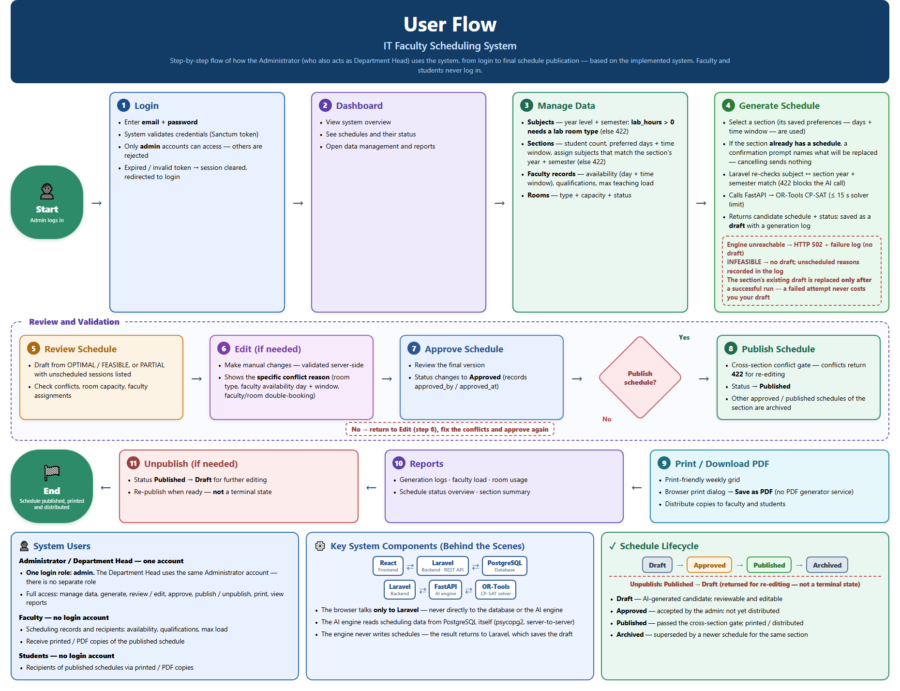

# Explainer — User Flow

**Figure:** [`screenshots/14-user-flow-modern.png`](screenshots/14-user-flow-modern.png) — 1860 × 1428 px, 261 KB
**Editable source:** `.tmp-run/diagram/user-flow.html` (not committed — a scratch file)
**Companion documents:** [`User-Flow.md`](User-Flow.md), [`System-User-Manual.md`](System-User-Manual.md)

*This file explains the user flow figure so you can present it and defend it. The steps match the implemented screens and the enforced rules.*

---

## 1. What this figure is

A picture of **what the human does** — the Administrator / Department Head's journey through the system, from logging in to distributing printed schedules.

It is the only one of the four views that is about a *person* rather than the software. Every other figure describes the system; this one describes the admin's path through it, with the enforced rules noted inline so you can see what the system does *to* the admin at each step.



---

## 2. The question it answers

> **"How does a person actually use this system, start to finish?"**

**It answers:**

- The ordered steps the admin takes
- What each screen requires and what the system enforces there
- The decision point where publication is chosen or declined
- What happens after publication (printing, reports, unpublishing)
- Who the system's users are — and who they are not
- The schedule's state transitions as the admin experiences them

**It does not answer:**

- How the system is built (**System Architecture**)
- What happens between components (**System Flow**)
- Which file or function implements a step (**Program Flow**)

---

## 3. How to read it — element by element

### Start and End pills

The green pill on the left, **Start**, is "Admin logs in". The green pill on the right is **End** — "Schedule published, printed and distributed". Everything between them is the working session.

### Row A — steps 1 to 4 (the setup phase)

| Step | Screen | What happens |
|---|---|---|
| **1 Login** | Login page | Email + password. Only **admin** accounts can access — others are rejected. A 401 later in the session clears the stored session and redirects back here. |
| **2 Dashboard** | Admin Dashboard | Overview, schedule list with statuses, and entry points to data management and reports. |
| **3 Manage Data** | Subjects · Sections · Faculty · Rooms | Maintains the inputs the engine needs. This card is the densest, because it is where the data quality is determined. |
| **4 Generate Schedule** | Admin Dashboard | Selects a section and runs generation. If that section already has a schedule, a confirmation prompt names what would be replaced before anything is sent. |

Three things are called out inside step 3 that are worth reading aloud, because they are the rules the admin must satisfy *before* they can get a good schedule:

- **Subjects** — a subject with lab hours requires a lab room type, otherwise 422.
- **Sections** — the subject checklist only offers subjects matching the section's year level and semester, otherwise 422.
- **Faculty records** — availability is declared as a **day plus a time window**, along with qualifications and a **maximum teaching load**. The load is a **weekly** figure, not daily.

Step 4 carries a dashed note box with the two failure outcomes: an unreachable engine gives HTTP 502 and a failure log with no draft, and an INFEASIBLE result produces no draft, with the unscheduled reasons recorded in the log. The card also states the ordering rule the admin benefits from: the section's existing draft is replaced **only after** a successful run, so a failed attempt never costs them their draft. The confirmation prompt on the same card is the misclick guard — it is **client-side**, so cancelling sends no request at all.

### The "Review and Validation" group — steps 5 to 8

The figure groups these in a dashed box because they are iterated, not traversed once:

| Step | Screen | What happens |
|---|---|---|
| **5 Review Schedule** | Dashboard | The draft from OPTIMAL / FEASIBLE, or PARTIAL with the unscheduled sessions listed. Checks conflicts, room capacity, faculty assignments. |
| **6 Edit (if needed)** | Inline session editor | Manual changes are validated **server-side**, and the specific conflict reason is shown — room type, faculty availability, or a double-booking. |
| **7 Approve Schedule** | Dashboard | Records `approved_by` and `approved_at` and moves the status to Approved. Still not distributed. |
| **◆ Diamond** | — | "Publish schedule?" — the only real branch in the user's path. |
| **8 Publish Schedule** | Dashboard | Runs the cross-section conflict gate. Conflicts return 422 for re-editing; otherwise status becomes Published, and the section's other approved or published schedules are archived. |

The **"No"** loop below the box is important: declining to publish sends the admin back to **step 6** to fix conflicts and approve again. This is the capture-and-refine loop that makes the system's output acceptable rather than merely automatic.

### Row C — steps 9 to 11 (the distribution phase)

> **Reading direction:** this row runs **right to left**. Visually the End pill is on the left and the arrows point left; the actual sequence is 9 → 10 → 11. Say this out loud when you present it, or a panelist may read it backwards.

| Step | What happens |
|---|---|
| **9 Print / Download PDF** | A print-friendly weekly grid; the browser's print dialog produces the PDF. There is **no PDF generator service**. Copies go to faculty and students. |
| **10 Reports** | Generation logs, faculty load, room usage, schedule status overview, section summary. |
| **11 Unpublish (if needed)** | Published → Draft for further editing, then re-publish when ready. The figure stresses that this is **not** a terminal state. |

### Bottom-left panel — System Users

The clearest statement in the whole figure set of who can log in: **one account, one role — admin.** The Department Head uses the same Administrator account; there is no separate Department Head login.

- **Faculty** — no login account. They exist as scheduling records (availability, qualifications, max load) and as **recipients of printed copies**.
- **Students** — no login account. Recipients of printed copies.

### Bottom-centre panel — Key System Components

The "behind the scenes" chain: React ⇄ Laravel ⇄ PostgreSQL, and Laravel ⇄ FastAPI ⇄ OR-Tools. Three claims are stated, all accurate: the browser talks only to Laravel, the engine reads PostgreSQL itself via psycopg2, and the engine never writes — Laravel saves the draft.

### Bottom-right panel — Schedule Lifecycle

Draft → Approved → Published → Archived, with the Unpublish note returning Published → Draft. Each state is defined in one line.

---

## 4. Where it goes

| Destination | How to use it |
|---|---|
| [`User-Flow.md`](User-Flow.md) | The prose companion — user types, the admin flow, and the non-user flows for faculty and students. This figure is its visual summary. |
| [`System-User-Manual.md`](System-User-Manual.md) | That document is the operational how-to; this figure is the one-page overview to put at its front. |
| Manuscript | The chapter on **system usage / user procedures**. This is the only figure written from the *user's* point of view, which makes it the one to use when the panel asks who uses the system and how. |
| [`System_Defense_Guide.md`](System_Defense_Guide.md) | Present it **fourth**, or use it as the opener if the panel is composed of users rather than developers. |
| Hearing order | **Fourth.** It shows the infrastructure figures paying off in an actual working session. |

> **Superseded figure:** `screenshots/10-user-flow-admin.png` (2494 × 6501) is the earlier Mermaid-derived version of this flow. This figure is the consolidated print-quality one.

---

## 5. Sixty-second spoken script

> "This is the administrator's path through the system — the only user role that logs in.
>
> It starts with login. Only admin accounts are accepted; a non-admin is rejected before a token is even issued. Then the dashboard, which is the hub for everything.
>
> Step 3 is the setup phase, and it is where a good schedule is actually determined. The admin enters subjects, sections, faculty and rooms. Three rules are enforced right here — a subject with lab hours must declare a lab room type; a section can only be assigned subjects matching its year level and semester; and each faculty member's availability is declared as a **day plus a time window**, with a weekly maximum teaching load.
>
> Step 4 generates the schedule. From there the figure groups steps 5 to 8 as a review-and-validation loop: the admin reviews the draft, edits it if needed, and every manual edit is validated server-side with the specific conflict reason shown. Then approve, and a publish-conflict gate. The 'No' path is deliberate — if there are conflicts, the admin goes back, fixes them and approves again. That loop is what makes the output usable rather than just automatic.
>
> Once published, the schedule is printed through the browser's print dialog — there's no separate PDF service — and the panel at the bottom lists the reports. Unpublish returns it to draft if changes are needed, so it is never a dead end.
>
> The bottom-left panel is the answer to 'who uses this system': one admin account. Faculty and students never log in — they're records and recipients of printed copies."

---

## 6. Likely panelist questions

**"Who are the users of this system?"**
One: the Administrator / Department Head. Faculty and students never log in — faculty are scheduling records, students are recipients of printed schedules. The figure states this explicitly in the bottom-left panel.

**"Why is there no Department Head login?"**
The SRS lists Administrator and Department Head as two user classes, but the implementation issues a single `admin` role that covers both — the Department Head signs in with the administrator account. It is a documented simplification: the two roles had identical permissions, so issuing two accounts would have added administration without adding control.

**"Can a faculty member see their own schedule in the system?"**
No. They receive a printed or PDF copy. There is no faculty portal by design.

**"What stops the admin from publishing a schedule with conflicts?"**
The publish-conflict gate at step 8. It compares the schedule against **other** sections' approved or published schedules and refuses with 422 if a room or a faculty member would clash. Publishing also archives the section's previously published schedule, so only one can be live at a time.

**"What happens if an edit breaks a rule?"**
The edit is rejected server-side with a 422, and the editor shows the **specific** reason — for example that a room is the wrong type, or that the faculty member is not available on that day within their declared window. It lists every conflict it finds, not just the first.

**"What happens if the admin deletes a room that's used in a published schedule?"**
The delete is refused first, with the exact cost. The API answers **409** with the number of sessions that would be destroyed *and* how many of those are in the published timetable, plus the published schedule ids — and nothing is mutated. The client then shows a **second** confirmation quoting that message, so the admin is agreeing to a specific, stated loss rather than a generic "are you sure?". If they decline, no request is sent at all; if they accept, it retries with `?force=1` and the delete proceeds.

The point is not to forbid the operation — master data genuinely changes — it is that destroying a live timetable must be a **deliberate act, not a side effect** of tidying up records. Be precise about what confirming costs, though: the room and every session referencing it are removed, and the affected published schedule **keeps its published status** while quietly losing rows. There is no audit row and no automatic downgrade, so recovery is manual — unpublish, fix the data, regenerate. Full sequence in `System-Architecture.md` § 2.10.

**"How does the admin fix a published schedule that needs a change?"**
Unpublish it — step 11 — which returns it to draft and clears the approval record. Then edit, approve and publish again. Requiring that two-step is intentional: it stops silent changes to a schedule that has already been distributed.

**"What if the AI produces a bad schedule?"**
It is only ever a draft. Nothing is distributed until the admin reviews it, optionally edits it, approves it, and publishes it. The AI produces a candidate; the human decides.

**"Where does the maximum teaching load come from?"**
The admin sets it on the faculty record at step 3. It is a **weekly** cap on total teaching hours, and the solver treats it as a hard constraint — including hours the faculty member already has from other published sections.

---

## 7. Accuracy notes and honest caveats

1. **The lifecycle panel omits `rejected`.** The figure shows Draft → Approved → Published → Archived plus the Unpublish return. The program also has a `rejected` status — and it is a **dead end**: a rejected schedule cannot be approved, published, or deleted through the API. The figure is not wrong, but it is incomplete on this point. If asked whether any state is missing, say so plainly.

2. **Row C reads right to left.** The arrows and the End pill sit on the left. Present the reading direction explicitly or the sequence will look reversed.

3. **The figure is 11 steps, not a strict sequence.** Steps 5–8 are a loop, and steps 10–11 are post-publication activities that may never be performed. Present it as phases — setup, generate, review, distribute — not as a rigid pipeline.

4. **"Reports" is drawn as part of the flow, but it is optional.** The admin views reports when they need to; it is not a required step before finishing.

5. **One faculty type is unreachable.** The figure says faculty records carry an employment type, which is true (`full_time`, `part_time`, `evening` in the database) — but the API and the UI only accept the first two. So `evening` cannot currently be set through the system.

6. **No faculty or student account exists, and none is planned in the current scope.** If a panel asks for a faculty self-service portal, treat it as future work rather than something the current design supports.

7. **The figure does not show master-data deletion, and deleting is not a step in the flow.** Deleting a faculty, subject, room or section record is an *interruption* rather than a stage of the journey — that is why it is absent from the diagram. But the guard around it is real and worth knowing: if a published schedule depends on the record, the API answers 409 with the exact scope and the client asks a second time before proceeding with `?force=1`. Do not let the figure's silence imply the operation is unprotected.

---

## 8. Regenerating the figure

```bash
# 1. Edit .tmp-run/diagram/user-flow.html
# 2. Open it in a browser and read document.body.scrollWidth / scrollHeight
# 3. Screenshot at exactly that size:
"/c/Program Files (x86)/Microsoft/Edge/Application/msedge.exe" \
  --headless=new --disable-gpu --no-first-run --hide-scrollbars \
  --user-data-dir="$(mktemp -d)" \
  --window-size=1860,1428 \
  --screenshot="documentation/screenshots/14-user-flow-modern.png" \
  "file:///<repo>/.tmp-run/diagram/user-flow.html"
```

`--window-size` must equal the measured page size or the capture clips. The current figure is 1860 × 1428. The output path must be **absolute** — Edge resolves a relative `--screenshot` path against its own working directory and silently fails to write.

---

## 9. How this view relates to the other three

| View | Figure | Answers |
|---|---|---|
| Architecture | [`15-system-architecture.png`](screenshots/15-system-architecture.png) · [explainer](Explainer-Architecture.md) | What is the system made of? |
| System Flow | [`16-system-flow.png`](screenshots/16-system-flow.png) · [explainer](Explainer-System-Flow.md) | What happens between components when it runs? |
| Program Flow | [`17-program-flow.png`](screenshots/17-program-flow.png) · [explainer](Explainer-Program-Flow.md) | What code runs, and where is each rule enforced? |
| **User Flow** | [`14-user-flow-modern.png`](screenshots/14-user-flow-modern.png) ← *you are here* | What does the admin do, step by step? |

Quick test for which view you are looking at: if an arrow could be labelled with a **URL or a port**, it is a flow view. If a box could be labelled with a **filename or function name**, it is program flow. If boxes are **components and tables**, it is architecture.
