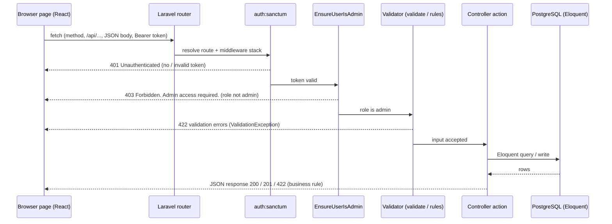
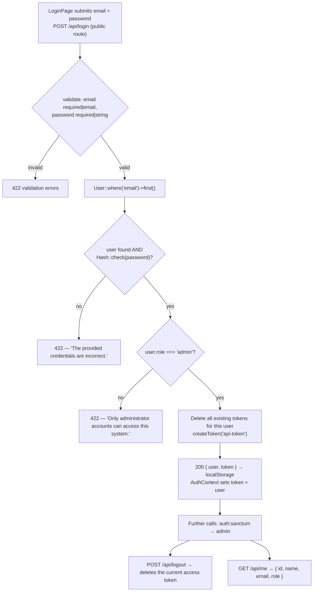
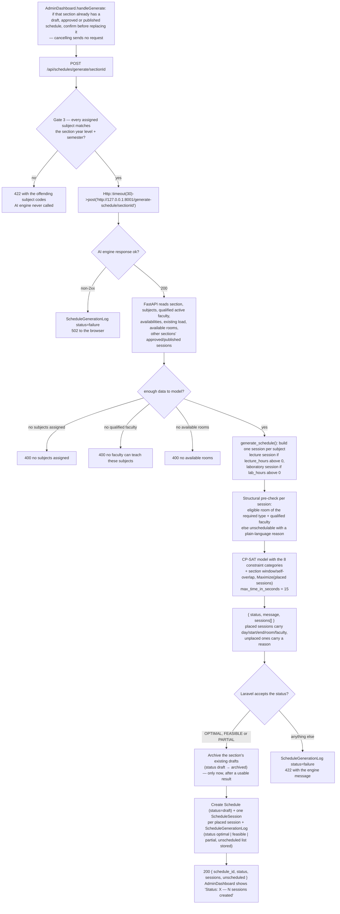
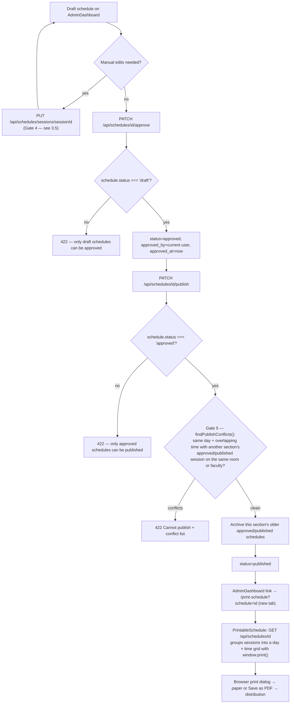
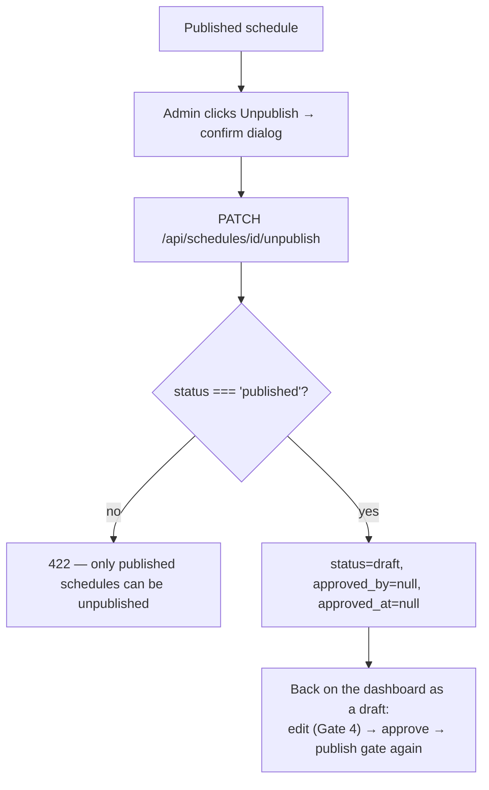
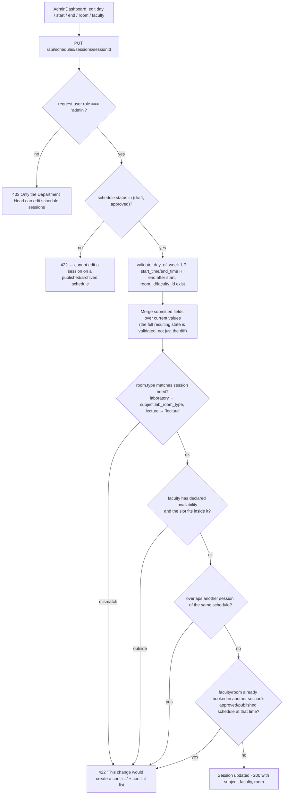

# Program Flow — IT Faculty Scheduling System

*Standalone companion to `User-Flow.md` (what the Admin does with the system) and `System-Architecture.md` (how the system is built). This document traces **how the program itself executes**: what runs first, which file handles each step, in what order, and where each validation gate sits.*

*Every step below was read out of the implementation — `backend/routes/api.php`, `backend/bootstrap/app.php`, the controllers in `backend/app/Http/Controllers/`, `ai-engine/api/app.py`, `ai-engine/solver/scheduler.py`, `frontend/src/main.tsx`, `frontend/src/App.tsx`, `frontend/src/context/AuthContext.tsx` and `frontend/src/pages/`. No behavior is described here that is not in the code; each section cites its file, and §5 maps every step to it.*

*The runtime claims — the status codes, the five validation gates, the publish and edit conflict gates, and the solver-result branching — were then **exercised against the live stack** (September 27, 2026) and corrected where the code read differently from the wire. §7 records every request and response, and flags the few paths that remain read-from-source.*

---

## 1. Program Entry and Control Flow

Both entry points exist: the browser program starts in `frontend/src/main.tsx` and the API program starts in `backend/public/index.php` (Laravel), which loads `backend/bootstrap/app.php` → `backend/routes/api.php`.

```mermaid
flowchart TD
    subgraph FE["Frontend — React + TypeScript + Vite (port 5173)"]
        M["main.tsx — createRoot renders App"]
        BR["App.tsx — BrowserRouter → AuthProvider → AppRoutes"]
        G{"AuthContext: user + token in localStorage?"}
        LP["LoginPage — POST /api/login"]
        PP["ProtectedRoute pages — AdminDashboard · RoomsPage · UsersPage ·<br/>FacultyPage · SubjectsPage · SectionsPage · ReportsPage · PrintableSchedule"]
        M --> BR --> G
        G -- "no" --> LP
        G -- "yes" --> PP
    end

    subgraph RT["Laravel routes — backend/routes/api.php"]
        PUB["POST /api/login — public route"]
        AUTHG["middleware auth:sanctum — logout · me"]
        ADMG{"middleware admin — EnsureUserIsAdmin"}
    end

    LP --> PUB
    PP -->|"fetch + Bearer token + Accept: application/json"| AUTHG
    AUTHG -->|"401 Unauthenticated"| PP
    AUTHG --> ADMG
    ADMG -- "role not admin" --> F403["403 Forbidden"]
    ADMG -- "role is admin" --> C

    C["Route controller — Auth · Faculty · Subject · Room · Section ·<br/>Schedule · ScheduleApproval · ScheduleSession · Report · User"]

    C --> G1["Gate 1 — SubjectController store/update:<br/>lab_hours above 0 requires a canonical lab_room_type;<br/>lab_hours = 0 requires none · else 422"]
    C --> G2["Gate 2 — SectionController store/update:<br/>assigned subjects must match section year + semester · else 422"]
    C --> G3["Gate 3 — ScheduleController generate:<br/>re-checks every assigned subject · 422 before the AI engine is called"]
    C --> G4["Gate 4 — ScheduleSessionController update:<br/>room type · faculty availability · self-overlap · external double-booking · 422"]
    C --> G5["Gate 5 — ScheduleApprovalController publish:<br/>cross-section conflict gate · 422 with conflict list"]

    G3 -- "clean" --> EP
    G4 -- "clean" --> SAVE["session updated · 200"]
    G5 -- "no conflicts" --> ARC["archive other approved/published schedules of this section"]
    ARC --> ST["status → published · 200"]

    subgraph AIE["AI engine — Python FastAPI (port 8001)"]
        EP["POST /generate-schedule/section_id"]
        SOL["solver/scheduler.py — OR-Tools CP-SAT<br/>max 15 s · maximize number of placed sessions"]
        EP --> SOL
    end

    SOL -->|"200 OPTIMAL · FEASIBLE · PARTIAL · INFEASIBLE · ERROR"| DEC{"Laravel accepts status?"}
    DEC -- "OPTIMAL, FEASIBLE or PARTIAL" --> DRAFT["Create Schedule status=draft<br/>+ ScheduleSession rows for placed sessions<br/>+ ScheduleGenerationLog"]
    DEC -- "anything else" --> FLOG["ScheduleGenerationLog status=failure<br/>422 to the browser"]
    DRAFT --> ADMIN["Admin reviews draft on AdminDashboard"]
    ADMIN --> EDIT{"Manual edit needed?"}
    EDIT -- "yes" --> G4
    EDIT -- "no" --> APR["PATCH /schedules/id/approve → status=approved"]
    APR --> G5
    ST --> PRINT["PrintableSchedule — GET /schedules/id<br/>weekly grid → window.print → PDF"]
    PRINT --> DIST["Hard-copy distribution to faculty and students"]

    subgraph DB["PostgreSQL"]
        TBL["schedules · schedule_sessions · schedule_generation_logs<br/>faculties · subjects · rooms · sections and their pivot tables"]
    end

    DRAFT --> TBL
    EP -.->|"psycopg2 reads of section, subjects, faculty, rooms,<br/>existing approved/published sessions"| TBL
```

*(Diagram source for the manuscript: `documentation/screenshots/program-flow.mmd`; rendered image: `documentation/screenshots/11-program-flow.png` — the block above and the `.mmd` file are the same 61 lines, so they cannot drift.)*

*Re-rendering after an edit (no Mermaid tooling is installed in this repository): either `npx -y @mermaid-js/mermaid-cli -i documentation/screenshots/program-flow.mmd -o documentation/screenshots/11-program-flow.png -b white`, or paste the `.mmd` into the Mermaid Live editor and export a PNG. The committed figure was rendered at 2600 px wide (`&width=2600` on the mermaid.ink renderer) for print legibility.*

**Reading the chart:**

1. `main.tsx` mounts `App`, which wraps `AppRoutes` in `BrowserRouter` and `AuthProvider`. `AuthContext` initializes `token` and `user` from `localStorage`, so a returning admin skips the login screen.
2. Every frontend route except `/login` is wrapped in `ProtectedRoute`, which redirects to `/login` when no user is in context (`App.tsx`). There is no faculty or student UI — the only dashboard is `AdminDashboard`.
3. API calls go to `API_BASE_URL = 'http://127.0.0.1:8000/api'` with `Authorization: Bearer <token>` + `Accept: application/json` (`context/AuthContext.tsx`, and the `headers()` helper in each page).
4. `bootstrap/app.php` registers one middleware alias, `admin → App\Http\Middleware\EnsureUserIsAdmin`. `routes/api.php` nests the whole admin surface inside `auth:sanctum` **and then** `admin`, so a request must first carry a valid token (401 otherwise) and then belong to an `admin` user (403 otherwise).
5. Past the middleware, the route's controller runs. Four of the five validation gates inside the controllers are application-layer data-integrity rules in Laravel, not solver constraints — they all answer **422** and never reach OR-Tools.

---

## 2. Generic Request Lifecycle

Every admin page follows the same cycle:

**Status codes the program actually returns:**

| Code | Produced by | When |
|---|---|---|
| 200 | controllers | Successful read/update/approve/publish/unpublish |
| 201 | `SubjectController::store`, `SectionController::store` (the section create was observed on the wire) | Record created |
| 401 | `auth:sanctum` | Missing or invalid Bearer token — observed; without an `Accept: application/json` header the same request answers **302** to the login route instead, which is why every frontend call sends the header |
| 403 | `EnsureUserIsAdmin` — observed; the `authorizeAdmin()` / role checks inside the controllers sit behind that middleware and are not reachable through these routes | Authenticated but not an `admin` |
| 404 | Route-model binding (`/schedules/{schedule}`, `/sections/{section}`, …) — observed, returning the framework's exception payload while `APP_DEBUG=true`; FastAPI answers its own 404 for an unknown section | Row does not exist |
| 422 | `$request->validate(...)`, business-rule gates (Gates 1–5), wrong-status actions | Input rejected — the standard rejection code for this program |
| 502 | `ScheduleController::generate` — two paths, both observed: a non-2xx engine response → `{"error":"AI engine request failed","details":"<engine response body>"}`, and an **unreachable** engine → `{"error":"AI engine unreachable","details":"<connection error>"}` | The AI engine answered with a non-2xx **response**, or could not be reached at all |
| 500 | Traced from source, not exercised: the engine's own `psycopg2.Error` / unexpected-exception handler. A Laravel-side connection failure used to surface here — it is now caught and answered as 502 (§6, observation 5) | Database or unexpected solver-side failure inside the engine |

Every row above was exercised against the running stack (`php artisan serve` + `uvicorn`) on September 27, 2026, except the 500 row, which is read from the engine's exception handler; §7 lists the requests and what came back.

**Note on login failures:** `AuthController::login` throws a `ValidationException` for both wrong credentials and a non-admin role, so the program answers **422 with an `email` error message** (not 401) — the frontend sends `Accept: application/json`, which is what makes Laravel render that as JSON instead of a redirect.

---

## 3. Per-Process Program Flows

### 3.1 Login and logout (`AuthController`)

- Login is the **only public route**; everything else sits behind `auth:sanctum`.
- Faculty have no accounts, so the role check is the program-level enforcement of the admin-only design (`FAC-AUTH-003`).
- Frontend logout clears `localStorage` (`AuthContext.logout`); the server-side token is revoked by `POST /api/logout`.
- **Observed live:** valid admin login → `200 {user, token}`; wrong password, unknown email and a missing field → 422 (`The provided credentials are incorrect.` / `The password field is required.`); a non-admin account → 422 `Only administrator accounts can access this system.`, so a non-admin can never obtain a token through the API — and a token minted for one directly still gets `403 Forbidden. Admin access required.` on admin routes while `/api/me` answers 200.

### 3.2 Schedule generation (`ScheduleController::generate` → FastAPI → CP-SAT)

- The engine's own failure codes surface to the browser as **502** (non-2xx from FastAPI), and an **unreachable** engine is caught and answered with the same 502 shape — each path writes its own `failure` log row before responding.
- Draft archiving happens **only after** the engine returns a usable result, and `AdminDashboard.handleGenerate` asks for confirmation up front when the section already has a schedule. **Previously** the bulk `draft → archived` ran *before* the engine call, so any failure left the section with its previous draft archived and no replacement — **observed**: a `FEASIBLE` rejection and an engine-500 run each archived the section's existing draft even though no new schedule was created, and a connection failure did too. **Fixed:** on 422 (INFEASIBLE/ERROR) and 502 (unreachable or non-2xx) the existing draft is now left untouched, pinned by `a_failed_generation_keeps_the_sections_existing_draft` and `an_infeasible_result_keeps_the_sections_existing_draft` in `ScheduleGenerationSectionTest`.
- The confirmation prompt is **client-side only** (`AdminDashboard.handleGenerate`): a misclick guard, not an enforced rule. It names what would be replaced — an existing draft, approved or published schedule — and cancelling sends no request at all; a direct API call bypasses it.
- The solver is a pure function: `ai-engine/api/app.py` does the reading (psycopg2) and `ai-engine/solver/scheduler.py` does the solving, with no HTTP code inside it.

### 3.3 Approve → publish → print (`ScheduleApprovalController`, `PrintableSchedule`)

- Approval requires `draft`, publishing requires `approved`; every other state answers 422 with the current status named — **observed** (`Only approved schedules can be published. This schedule is currently 'published'.`; `Only draft schedules can be approved. …`; `Only published schedules can be unpublished.`).
- **Observed:** publishing a second schedule for the same section answered 200 and archived that section's previously published schedule, exactly as the diagram shows.
- The publish gate compares only against **other sections'** approved/published schedules — a section never conflicts with itself.
- Print is a read-only page: it fetches one schedule (`GET /api/schedules/{schedule}`) and calls `window.print()`.

### 3.4 Unpublish (`ScheduleApprovalController::unpublish`)

Unpublishing returns the **current** schedule to draft for editing; it does not restore any earlier schedule version.

### 3.5 Manual session edit (`ScheduleSessionController::update`)

This is protection layer 2 — the same rules that the solver enforces at generation time are re-checked on every manual edit.

**Observed:** one rejected edit returned all five conflict classes at once — room type (`Room 'ROOM6' is type 'lecture', but this session needs 'computer_lab'.`), faculty availability (`… is not available on day 2 from 7:00 PM to 9:00 PM.`), same-schedule overlap, cross-section faculty double-booking, and cross-section room double-booking — which confirms the merge-then-validate-full-state behavior. Putting a session on a **published** schedule answers 422 `Cannot edit a session on a 'published' schedule.`, and a clean change answers 200.

### 3.6 Reports (`ReportController`, `ReportsPage`)

`ReportsPage` fires all five report calls in parallel on load; every report is read-only and admin-gated.

| Page tab | Endpoint | Controller method | Reads |
|---|---|---|---|
| Overview (schedule status) | `GET /api/reports/schedule-status` | `scheduleStatusOverview` | `schedules` grouped by status + total |
| Faculty Load | `GET /api/reports/faculty-workload` | `facultyWorkload` | published sessions per faculty vs `max_teaching_load` |
| Room Usage | `GET /api/reports/room-utilization` | `roomUtilization` | published sessions per room, summed hours |
| Sections | `GET /api/reports/section-summary` | `sectionSummary` | published sessions per section: count, hours, faculty count |
| Generation Logs / Conflicts | `GET /api/reports/conflicts` | `conflicts` | `schedule_generation_logs` with section + requester |

### 3.7 CRUD pages (shared shape)

`RoomsPage`, `UsersPage`, `FacultyPage`, `SubjectsPage` and `SectionsPage` all follow one program shape: `GET` the list on mount → open the form → `POST`/`PUT`/`DELETE` with `headers()` → re-fetch the list. Two of them carry a gate on write: `SubjectsPage` (Gate 1) and `SectionsPage` (Gate 2, whose subject checklist is filtered to the section's own year level and semester). `FacultyPage` additionally manages qualifications (`/faculties/{id}/subjects`) and availability (`/faculties/{id}/availability`), which feed the solver's qualification and availability constraints.

---

## 4. Program-Level Status and State Handling

### 4.1 Schedule status transitions (as written by the code)

`schedules.status` is a plain string column (default `draft`, no database enum — see `create_schedules_table`), so the transitions below are enforced entirely in controller logic.

| Action (code path) | Allowed from | Result | Rejection |
|---|---|---|---|
| `ScheduleController::generate` (success) | — | creates `draft` | 422 if the status returned by the engine is not OPTIMAL/FEASIBLE/PARTIAL |
| `ScheduleController::generate` (success, just before the replacement is written) | `draft` | bulk `draft → archived` for that section | — (a failed or infeasible run archives nothing) |
| `ScheduleApprovalController::approve` | `draft` | `approved` + `approved_by` + `approved_at` | 422 with current status |
| `ScheduleApprovalController::publish` | `approved` | `published`; older `approved`/`published` of the same section → `archived` | 422 on wrong status, 422 on conflicts |
| `ScheduleApprovalController::unpublish` | `published` | `draft`, `approved_by`/`approved_at` cleared | 422 |
| `ScheduleApprovalController::reject` | `draft` | `rejected` | 422 |
| `ScheduleApprovalController::destroy` | `draft`, `archived` | sessions deleted, then the schedule | 422 |
| `ScheduleSessionController::update` | schedule `draft` or `approved` | session row updated | 422 otherwise |

**Flow:** `draft → approved → published → archived`, with `unpublish` returning `published → draft` for re-editing and `reject` sending a draft to `rejected`.

Every transition in this table was exercised through the API, including the wrong-state rejections and the full unpublish loop (`published → draft` → re-approve → re-publish). `reject` is the one transition still read from source — the demo data has no rejected schedules and the probe did not create one.

### 4.2 Solver result branching (`ai-engine/solver/scheduler.py`)

| Returned status | When the solver sets it | Laravel's handling (`ScheduleController`) |
|---|---|---|
| `OPTIMAL` | Every computed session placed **and** the solver proved the objective optimal | Accepted → draft + log `optimal` |
| `FEASIBLE` | Every computed session placed but the 15 s limit was hit before optimality was proven | **Accepted** → draft + log `feasible`, exactly like `OPTIMAL` (it used to be rejected as a failure — §6, observation 1, and the before/after row in §7) |
| `PARTIAL` | Some sessions placed (`scheduled_count > 0`) — each unplaced session carries a reason | Accepted → draft + log `partial`, unscheduled list stored |
| `INFEASIBLE` | No session could be placed; reasons reported per session | Log `failure`, 422 with the engine message — observed live as `{"status":"INFEASIBLE","message":"No sessions could be scheduled. See individual reasons."}` with all three unplaced sessions stored, each carrying a plain-language reason (`No room of type 'lecture' exists for this lecture session.`) |
| `ERROR` | The section has no subject with lecture or lab hours defined (engine-side guard in `app.py` returns 400 earlier for "no subjects assigned") | Log `failure`, 422 |

Session-level reasons are always preserved: structurally impossible sessions (no room of the required type/status/capacity, no qualified faculty) get a reason during the pre-check pass, and sessions that the CP-SAT model could not place get the "could not fit given room, faculty, or time conflicts" reason.

### 4.3 Generation log vocabulary

`ScheduleController` writes `schedule_generation_logs.status` as **lowercase**: `strtolower($result['status'])` → `optimal`, `feasible` or `partial` on success, and the literal `failure` for every failed path (unreachable engine, non-2xx engine response, or a status Laravel does not accept — currently only `INFEASIBLE` and `ERROR`). `unscheduled_sessions` stores the unplaced sessions with their reasons, which is exactly what the Reports → Generation Logs tab displays.

**Observed while exercising the API:** before this pass's fix the stored vocabulary was exactly `optimal | partial | failure` (the demo database holds 32 / 9 / 12 of them) and an unreachable engine wrote nothing at all; now a fully-placed `FEASIBLE` run stores `feasible`, and both 502 paths store `failure` with the engine's body (or the connection error) in `message`. A subject–section mismatch blocked by Gate 3 still writes **no** row, and log rows **cascade-delete with their section** (`section_id … cascadeOnDelete`), observed when the probe section was deleted.

### 4.4 Frontend state handling

- `AuthContext` holds `token` + `user` and mirrors both into `localStorage`; `ProtectedRoute`/`Dashboard` redirect to `/login` when `user` is null. A centralized `fetch` interceptor in the same module watches for HTTP `401`: it clears the stored `token`/`user` and redirects to `/login`, so an expired token never leaves a page rendering empty data. The login endpoints are exempt so a failed sign-in still shows its own error.
- `AdminDashboard` keeps `selectedSectionId` (initially null, auto-selected from the loaded section list), re-fetches schedules whenever the "Show archived" toggle changes (`?show_archived=`), and surfaces generation outcomes as `Status: X — N sessions created` or the server's error message. `handleGenerate` also asks for confirmation when the selected section already has a non-archived schedule, naming the draft/approved/published record(s) it would replace.
- Edit conflicts are shown in the edit dialog itself (`editError`), listing the specific conflict reason(s) returned in the API's `conflicts` array (e.g. faculty availability windows, room type, overlaps); approve/publish/unpublish errors via `alert()`.

---

## 5. File and Function Index

| Flow step | File | Function / entry |
|---|---|---|
| Program start (browser) | `frontend/src/main.tsx` | `createRoot(...).render(<App/>)` |
| Routing + guards | `frontend/src/App.tsx` | `App`, `AppRoutes`, `ProtectedRoute`, `Dashboard` |
| Auth state + API base | `frontend/src/context/AuthContext.tsx` | `AuthProvider`, `login`, `logout`, `API_BASE_URL` |
| Dashboard actions | `frontend/src/pages/AdminDashboard.tsx` | `headers()`, `fetchSchedules`, `handleGenerate`, `handleApprove`, `handlePublish`, `handleUnpublish`, `confirmDelete`, `saveEditSession` |
| Print / PDF view | `frontend/src/pages/PrintableSchedule.tsx` | schedule fetch + grid build + `window.print()` |
| Reports UI | `frontend/src/pages/admin/ReportsPage.tsx` | 5 parallel report fetches |
| CRUD UIs | `frontend/src/pages/admin/{Rooms,Users,Faculty,Subjects,Sections}Page.tsx` | list/create/update/delete handlers |
| Routes + middleware stack | `backend/routes/api.php` | `auth:sanctum` group, `admin` group |
| Middleware alias | `backend/bootstrap/app.php` | `'admin' => EnsureUserIsAdmin::class` |
| Admin gate | `backend/app/Http/Middleware/EnsureUserIsAdmin.php` | `handle()` → 403 |
| Login / logout / me | `backend/app/Http/Controllers/AuthController.php` | `login`, `logout`, `me` |
| Gate 1 (subject lab consistency) | `backend/app/Http/Controllers/SubjectController.php` | `subjectRules`, `labConsistencyErrors`, `store`, `update` |
| Gate 2 (subject–section integrity) | `backend/app/Http/Controllers/SectionController.php` | `subjectMismatches`, `store`, `update` |
| Gate 3 + generation | `backend/app/Http/Controllers/ScheduleController.php` | `generate` |
| Gate 4 (edit conflicts) | `backend/app/Http/Controllers/ScheduleSessionController.php` | `update`, `findConflicts`, `overlaps` |
| Gate 5 + lifecycle | `backend/app/Http/Controllers/ScheduleApprovalController.php` | `approve`, `publish`, `unpublish`, `reject`, `destroy`, `findPublishConflicts` |
| Reports data | `backend/app/Http/Controllers/ReportController.php` | `facultyWorkload`, `roomUtilization`, `conflicts`, `scheduleStatusOverview`, `sectionSummary` |
| AI engine endpoint | `ai-engine/api/app.py` | `generate_schedule_for_section`, `health`, `get_connection` |
| Solver | `ai-engine/solver/scheduler.py` | `generate_schedule()` |
| Solver test suite | `ai-engine/tests/test_scheduler.py` | 46 unittest cases against `generate_schedule()` |

---

## 6. Observations Recorded While Tracing the Code

Documentation-only notes — nothing here was changed, and each is traceable to the file named. They are recorded so the code and the manuscript tell the same story.

1. **`FEASIBLE` was treated as a failure by Laravel — observed, then fixed.** The solver returns `FEASIBLE` when every session is placed but optimality was not proven within the 15 s limit (`scheduler.py`, `overall_status = solver.StatusName(status)`), while `ScheduleController::generate` accepted only `['OPTIMAL', 'PARTIAL']`. Driving the real endpoint with a `FEASIBLE` payload returned **422 `{"status":"FEASIBLE","message":"No feasible schedule found."}`** and wrote a `failure` log row — a fully-placed schedule reported to the Admin as "no feasible schedule found". **Fixed:** `FEASIBLE` is now accepted alongside `OPTIMAL`/`PARTIAL` and logged as `feasible`, with regression tests in `ScheduleGenerationSectionTest` (`feasible_result_is_accepted_and_logged_as_feasible`, plus an `INFEASIBLE` guard so the boundary cannot drift).
2. **The `GET /api/login` fallback route is unreachable but now returns its JSON body when reached.** It is declared *inside* the `auth:sanctum` + `admin` groups in `routes/api.php`, so an unauthenticated caller gets 401 from the guard and a non-admin caller gets 403 from the middleware before the closure runs; the closure's earlier missing `return` (which would have produced an empty response) has since been fixed to return the JSON 401 payload.
3. **`rejected` is a real schedule status that appears in no documented lifecycle — observed live, now clearable.** `ScheduleApprovalController::reject` writes `status = 'rejected'` (observed: `200` on a draft). The ERD value lists include `rejected`, and the state is still unreachable from the UI (there is no reject button), but it is no longer a dead end: `DELETE` accepts it, because the delete rule is stated as a single exception rather than an allow-list — **every schedule except `published` can be deleted**, and `published` must be unpublished first. `approve` still answers `422 … currently 'rejected'.`, so a rejected row cannot be reactivated without unpublish-style editing; it can only be discarded.
4. **Log-status vocabulary differs from the migration comment — fixed.** `create_schedule_generation_logs_table` commented the column as "success, partial, failure" while the code wrote `optimal`/`partial`/`failure`; the comment now reads `optimal | feasible | partial | failure`, matching the code and the ERD value list.
5. **The Laravel → engine call had no exception handling — observed, then fixed.** Only a non-2xx *response* became a 502 (verified with the engine answering 400 and 500); with the engine stopped the endpoint returned **500** carrying `Illuminate\Http\Client\ConnectionException` and `cURL error 7: Failed to connect to 127.0.0.1:8001`, and — unlike every other failure path — wrote **no** generation log row, so an engine outage left no trace in the Reports → Generation Logs tab. **Fixed:** `generate()` now catches `ConnectionException` and answers **502 `{"error":"AI engine unreachable","details":…}`** after writing its `failure` row (`unreachable_engine_returns_502_and_writes_a_failure_log`).
6. **Engine time budget vs HTTP budget.** The solver is capped at 15 s (`max_time_in_seconds = 15.0`) inside a 30 s HTTP timeout, and one request is issued per section — sequential generation of many sections can approach the HTTP limit before the solver's own budget matters.
7. **`student_count` is settable through the application — the earlier "cannot be set" observation is resolved.** The solver's capacity constraint reads `sections.student_count`; the column is now in `Section::$fillable`, validated by `SectionController` (`sometimes|integer|min:1|max:1000`), and exposed on the Sections page, so the Admin can set the class size and the capacity constraint uses it. When a client omits it, the migration default (30) still applies.

---

## 7. Verification — What Was Exercised

The two defects this pass fixed (observations 1 and 5 in §6) were re-verified on the same live stack after the change, and the affected rows below record both the before and after observations.

Every status code and branch in §2, §3 and §4 was driven against the running stack on September 27, 2026: `php artisan serve` on port 8000, `uvicorn api.app:app` on port 8001, PostgreSQL on 5432, and `curl` with a real Sanctum token from `POST /api/login` (seeded admin, `admin@example.com`). The two rows marked with a stub below used a throwaway in-process server on port 8001 (removed afterwards) so that the `FEASIBLE` and engine-error branches could be reached deterministically; every other row ran against the real FastAPI engine.

| Probe | Request | Observed |
|---|---|---|
| Unauthenticated request | `GET /api/schedules`, no token | `401 {"message":"Unauthenticated."}` |
| Login failures | `POST /api/login` wrong password / unknown email / missing field | `422` with `errors.email` / `errors.password` |
| Login success | `POST /api/login` admin | `200 {user, token}` |
| Non-admin rejection | `POST /api/login` as a non-admin account | `422 Only administrator accounts can access this system.` |
| Middleware gate | admin-only route with a token minted for that non-admin | `403 {"message":"Forbidden. Admin access required."}`; the same token on `/api/me` → `200` |
| Unknown row | `GET /api/schedules/999999` | `404`, framework exception payload |
| Subject-less generation | scratch section with no subjects → `POST /schedules/generate/{id}` | engine `400` → Laravel `502 {"error":"AI engine request failed","details":"{\"detail\":\"Section N has no subjects assigned.\"}"}` + `failure` log row |
| Engine unreachable | engine stopped, `POST /schedules/generate/5` | **before:** `500` + `ConnectionException` (cURL error 7), **no** log row; **after the fix:** `502 {"error":"AI engine unreachable","details":"cURL error 7: …"}` + a `failure` log row |
| `FEASIBLE` result | stub answering `{"status":"FEASIBLE","message":null,"sessions":[…]}` | **before:** `422 {"status":"FEASIBLE","message":"No feasible schedule found."}` + `failure` row; **after the fix:** `200` with a new `draft`, its sessions stored, and a `feasible` log row reading "All sessions scheduled successfully." |
| Engine 500 response | stub answering HTTP 500 | `502` + `failure` log row carrying the engine body |
| Section–subject gate | mismatched subject attached to a section, then generate | `422` naming the offending subject; engine access log unchanged, no log row, no schedule created |
| Happy-path generation | `POST /schedules/generate/5` with valid data | `200 {schedule_id, status:"OPTIMAL", sessions, unscheduled}`, new `draft`, `optimal` log row, older draft auto-archived |
| Approval / publish | `PATCH /schedules/{id}/approve` then `/publish` | `200` `approved` (with `approved_by`/`approved_at`) then `200` `published` |
| Wrong-state actions | approve a published schedule; publish twice; unpublish twice | `422` with the current status named, each time |
| Unpublish loop | `PATCH /unpublish` then re-approve, re-publish | `200` → `draft` (approval fields cleared) → `200` → `200` |
| Publish conflict gate | conflicting session in another section's approved schedule, then publish | `422 {"message":"Cannot publish: …","conflicts":["Room 'ROOM6' is booked day 2 7:00 PM–9:00 PM (schedule #77, section BIT-3A)."]}` — the sentence names the clock time in 12-hour form; the machine-readable `start_time`/`end_time` fields stay 24-hour |
| Publish after fixing the clash | move the session, publish again | `200 published` — the gate rejects only real conflicts |
| Edit gate (all classes) | `PUT /schedules/sessions/{id}` onto a clashing slot | `422` listing room type, faculty availability, self-overlap, cross-section faculty and cross-section room conflicts |
| Edit gate (clean / wrong state) | valid change; session on a published schedule | `200` with the reloaded relations; `422 Cannot edit a session on a 'published' schedule.` |
| Same-section auto-archive | publish a second schedule for a section that already has a published one | `200`, previous schedule → `archived` |
| `INFEASIBLE` result | section given a lab subject and a student count above every room capacity, then generate | `422 {"status":"INFEASIBLE","message":"No sessions could be scheduled. See individual reasons."}` + `failure` row storing all three sessions with reasons (`No room of type 'lecture' exists for this lecture session.`, `No room of type 'computer_lab' exists for this laboratory session.`) |
| `reject` transition | `PATCH /schedules/{id}/reject` on a draft | `200` → `status = rejected`; `DELETE` afterwards → `200` (every unpublished schedule is deletable); `approve` → `422 … currently 'rejected'.` |

**Still read from source, not exercised here:** the engine's own `500` paths (`psycopg2.Error`, unexpected exception), FastAPI's `404` for a deleted section, and the five `GET /api/reports/*` endpoints (§3.6), plus the frontend-side behaviors described in §4.4 — those were traced in code and in the earlier UI walkthrough, not re-run in this pass. The 46-case AI-engine suite was re-run and passes (`Ran 46 tests … OK`), which is what makes `FEASIBLE` a real, reachable engine result.

**State restored:** every row created for these probes (schedules, sessions, generation-log rows, the scratch section, the non-admin account) was deleted afterwards. After the later cleanup of the stale draft schedule #73 (and its out-of-window session #300), the demo database holds: 31 schedules (29 archived / 1 published / 1 draft), 86 sessions, 53 generation logs, with 0 remaining faculty-availability violations.
