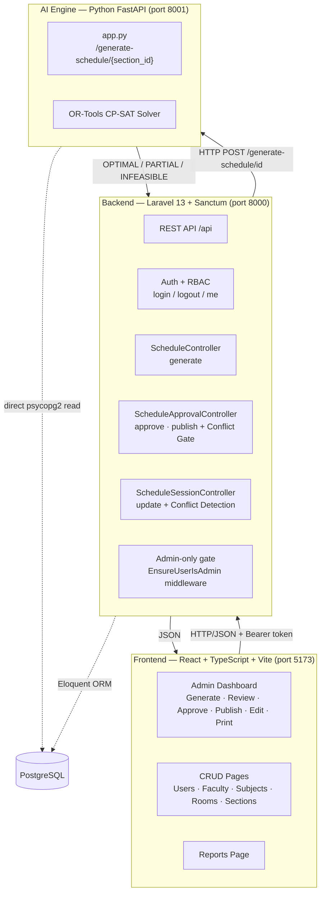
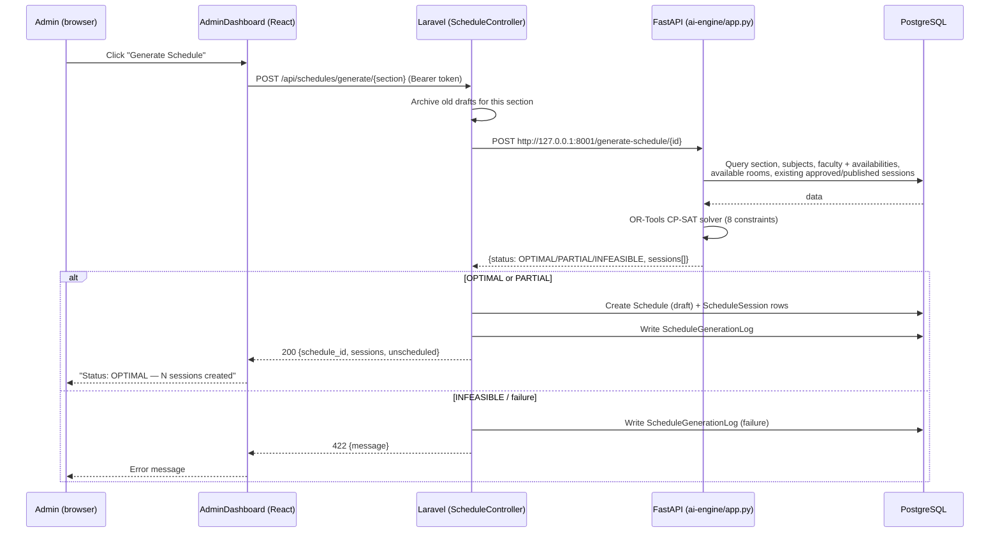
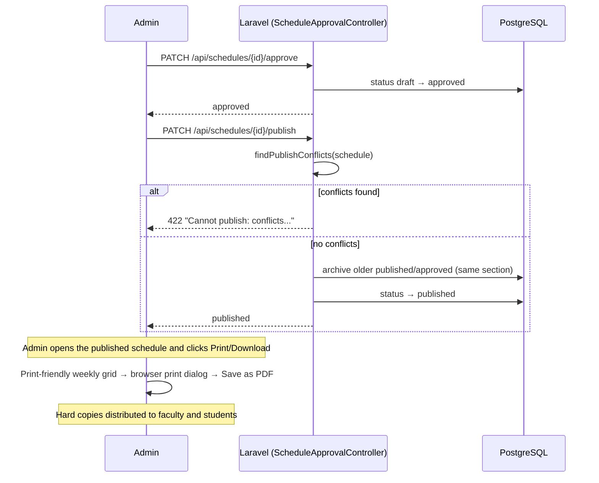
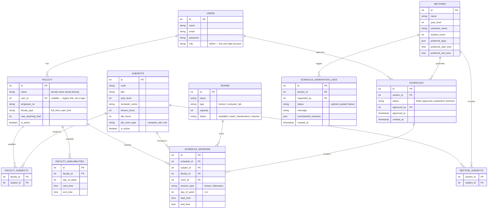

# System Architecture — IT Faculty Scheduling System

## 1. Architecture Overview



## 2. Data Flow

### 2.1 Schedule Generation Flow



### 2.2 Approve → Publish → Print/Download Flow




### 2.2.1 Print / Download Flow (Hard-Copy Distribution)

After a schedule is published, the Admin produces the hard copy for distribution:

1. Admin opens the published schedule and clicks **Print / Download**
2. A print-friendly weekly grid view opens (department header, section name, day columns × time rows, subject/faculty/room per cell)
3. The browser print dialog opens — the Admin prints directly or chooses **Save as PDF**
4. Printed/PDF copies are distributed to faculty and posted for students

**Design note:** Faculty do not log into the system. Faculty are records used by the scheduling engine; published schedules reach them as printed/PDF copies. This shrinks the security surface and matches the per-semester usage pattern of the department.

### 2.2.2 Unpublish Flow

When an admin needs to make changes to a published schedule:

1. Admin clicks "Unpublish" button on a published schedule
2. Confirmation dialog appears: "Unpublish this schedule? It will revert to draft for editing."
3. On confirmation, system calls PATCH /api/schedules/{id}/unpublish
4. Schedule status changes from "published" to "draft"
5. Schedule can now be edited and goes through the approval workflow again

**API Endpoint:** PATCH /api/schedules/{schedule}/unpublish

**Response:**
- Success: { message: "Schedule unpublished and reverted to draft." }
- Error: { message: "Only published schedules can be unpublished." }


## 2.4 Reports Dashboard

The Reports page provides analytics and summaries with the following tabs:

| Tab | Description | Data Source |
|-----|-------------|-------------|
| **Overview** | Schedule Status Overview (Archived/Published counts), Faculty Members count, Rooms count, Sections count | /api/reports/overview |
| **Faculty Load** | Faculty workload distribution, hours per faculty member | /api/reports/workload |
| **Room Usage** | Room utilization rates, booking frequency per room | /api/reports/room-utilization |
| **Sections** | Section schedules, session counts per section | /api/reports/sections |
| **Generation Logs** | Schedule generation history, success/failure rates | /api/reports/generation-logs |

### Schedule Status Overview
- **Archived**: Count of schedules that have been archived (old versions)
- **Published**: Count of currently active published schedules
- **Total Schedules**: Sum of all schedules in the system

### Resource Summary
- **Faculty Members**: Total faculty count with active load indicator
- **Rooms**: Total rooms with breakdown (lecture rooms, labs)
- **Sections**: Total sections with total session count

## 3. Database Design (ER Diagram)



## 4. Project Structure

```text
it-faculty-scheduling-system/
├── ai-engine/                      # Python FastAPI (port 8001)
│   ├── api/app.py                  # OR-Tools CP-SAT solver + endpoints
│   ├── seed_rooms.py
│   ├── requirements.txt
│   └── .env                        # (ignored)
│
├── backend/                        # Laravel 13 + Sanctum (port 8000)
│   ├── app/
│   │   ├── Http/Controllers/       # Auth, User, Faculty, Subject, Room,
│   │   │                           #   Section, Schedule, ScheduleApproval,
│   │   │                           #   ScheduleSession, Report
│   │   ├── Models/                 # User, Faculty, Room, Subject, Section,
│   │   │                           #   Schedule, ScheduleSession, ...
│   │   └── Providers/AppServiceProvider.php
│   ├── bootstrap/app.php
│   ├── config/
│   ├── database/migrations/        # 15 tables
│   ├── routes/api.php
│   └── .env                        # (ignored)
│
├── frontend/                       # React + TypeScript + Vite (port 5173)
│   └── src/
│       ├── App.tsx
│       ├── context/AuthContext.tsx
│       └── pages/                  # Login, AdminDashboard,
│                                   #   Users, Faculty, Subjects, Rooms,
│                                   #   Sections, Reports
│
├── documentation/                  # API.md, Requirements.md, SRS.md, Modules.md,
│                                   #   Constraints.md, Bug-Fix-Log.md, ...
│
├── .gitignore
├── LICENSE
└── README.md
```
