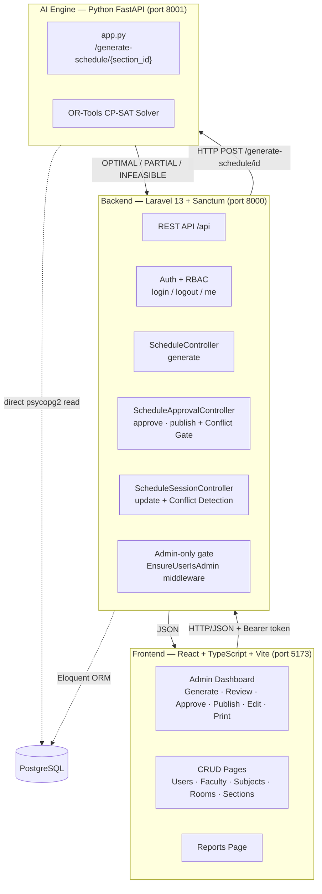
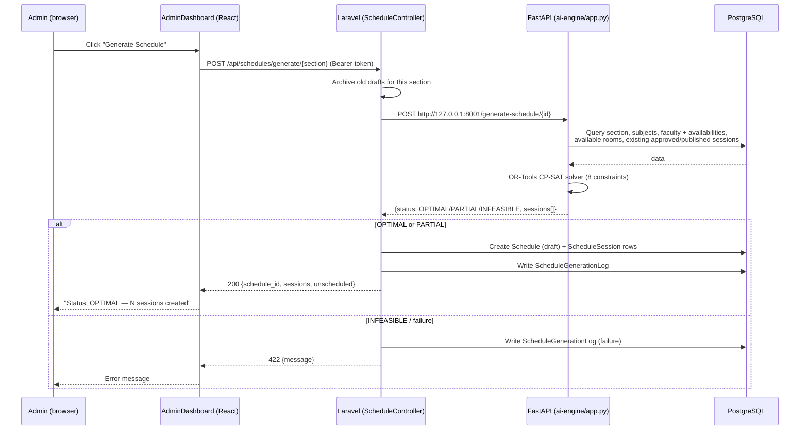
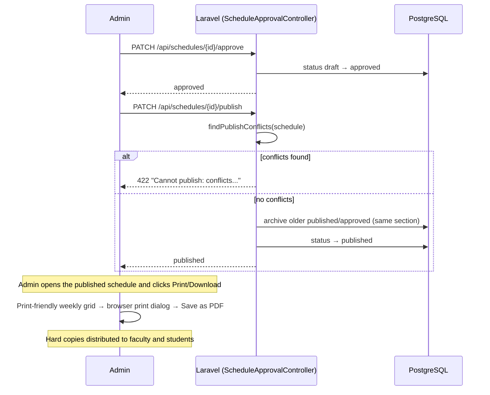
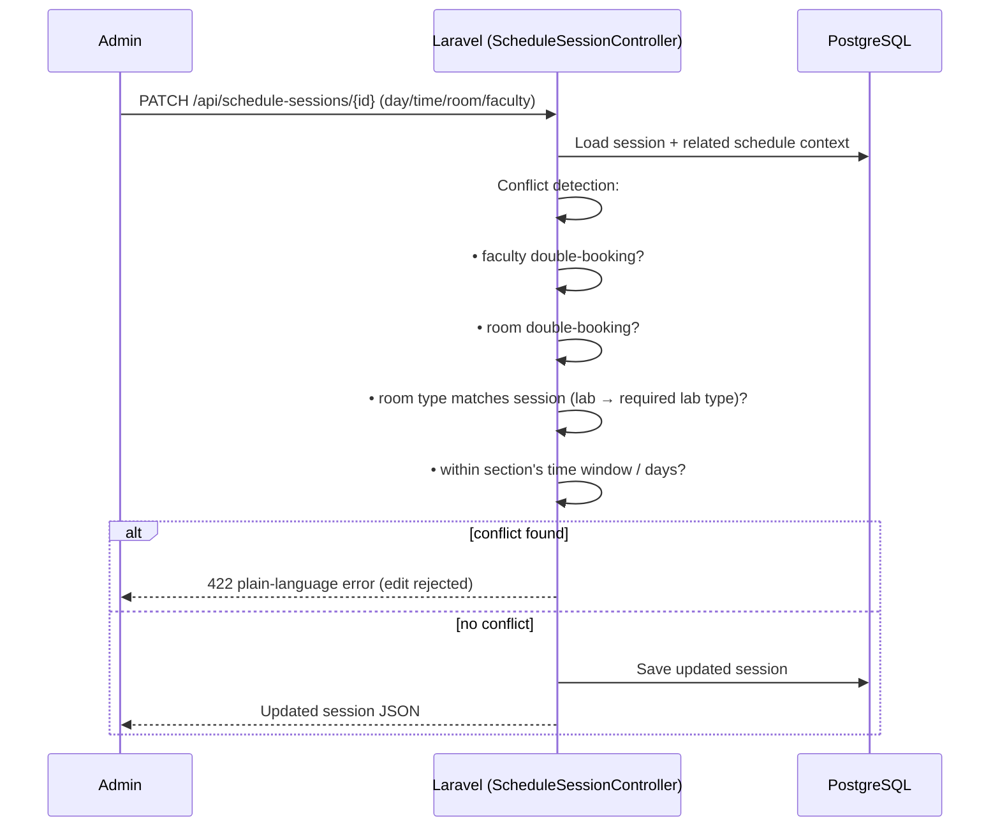
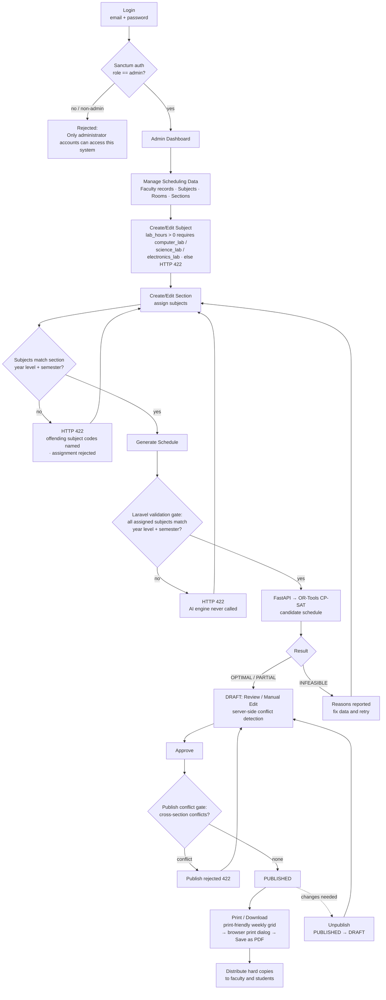
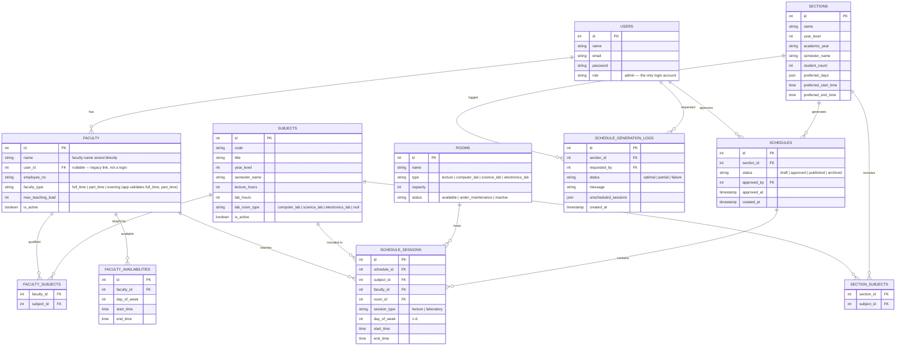

# System Architecture — IT Faculty Scheduling System

## 1. Architecture Overview

> **Role model:** The authorized **Admin / Department Head** is the only system user and operator. **Faculty are scheduling records/entities, not system users** — they never log in. Faculty data (name, employee number, employment type, qualifications, subject assignments, availability, max teaching load) feeds the scheduling engine, and published schedules reach faculty and students as **printed/PDF copies**.

### The three protection layers (conflicts can never slip through)

1. **AI generation constraints** — the CP-SAT solver mathematically enforces all constraint categories when producing a candidate schedule
2. **Manual edit conflict detection** — every admin edit of a draft/approved session is re-checked server-side
3. **Publish conflict gate** — a final cross-section conflict check runs before any schedule goes live

Plus a **pre-scheduling validation gate in Laravel** (application-layer business rules, not solver constraints): subject–section year/semester integrity (FR-018) and subject lab consistency (FR-019) are enforced when data is saved and re-checked before the AI engine is ever called — invalid assignments return HTTP 422 and cannot reach the solver.

> **Human oversight:** Publishing never happens automatically. The AI produces a *candidate* schedule only; the Admin reviews, edits, approves, and decides publication through the conflict gate.

```mermaid
graph TB
    subgraph Frontend["Frontend — React + TypeScript + Vite (port 5173)"]
        AD[Admin Dashboard<br/>Generate · Review · Approve · Publish · Edit · Print]
        CP[CRUD Pages<br/>Users · Faculty · Subjects · Rooms · Sections]
        RP[Reports Page]
    end

    subgraph Backend["Backend — Laravel 13 + Sanctum (port 8000)"]
        API[REST API /api]
        AUTH[Auth + RBAC<br/>login / logout / me]
        SCH[ScheduleController<br/>generate]
        SAP[ScheduleApprovalController<br/>approve · publish + Conflict Gate]
        SES[ScheduleSessionController<br/>update + Conflict Detection]
        AUTHGATE[Admin-only gate<br/>EnsureUserIsAdmin middleware]
    end

    subgraph AI["AI Engine — Python FastAPI (port 8001)"]
        APP["app.py<br/>/generate-schedule/{section_id}"]
        SOLVER[OR-Tools CP-SAT Solver]
    end

    DB[(PostgreSQL)]

    Frontend -->|HTTP/JSON + Bearer token| Backend
    Backend -->|HTTP POST /generate-schedule/id| AI
    AI -->|OPTIMAL / PARTIAL / INFEASIBLE| Backend
    AI -.direct psycopg2 read.-> DB
    Backend -.Eloquent ORM.-> DB
    Backend -->|JSON| Frontend
```

## 2. Data Flow

### 2.1 Schedule Generation Flow


```mermaid
sequenceDiagram
    participant U as Admin (browser)
    participant F as AdminDashboard (React)
    participant L as Laravel (ScheduleController)
    participant A as FastAPI (ai-engine/app.py)
    participant DB as PostgreSQL

    U->>F: Click "Generate Schedule"
    F->>L: POST /api/schedules/generate/{section} (Bearer token)
    L->>L: Archive old drafts for this section
    L->>A: POST http://127.0.0.1:8001/generate-schedule/{id}
    A->>DB: Query section, subjects, faculty + availabilities,<br/>available rooms, existing approved/published sessions
    DB-->>A: data
    A->>A: OR-Tools CP-SAT solver (8 constraints)
    A-->>L: {status: OPTIMAL/PARTIAL/INFEASIBLE, sessions[]}
    alt OPTIMAL or PARTIAL
        L->>DB: Create Schedule (draft) + ScheduleSession rows
        L->>DB: Write ScheduleGenerationLog
        L-->>F: 200 {schedule_id, sessions, unscheduled}
        F-->>U: "Status: OPTIMAL — N sessions created"
    else INFEASIBLE / failure
        L->>DB: Write ScheduleGenerationLog (failure)
        L-->>F: 422 {message}
        F-->>U: Error message
    end
```

### 2.2 Approve → Publish → Print/Download Flow


```mermaid
sequenceDiagram
    participant U as Admin
    participant L as Laravel (ScheduleApprovalController)
    participant DB as PostgreSQL

    U->>L: PATCH /api/schedules/{id}/approve
    L->>DB: status draft → approved
    L-->>U: approved

    U->>L: PATCH /api/schedules/{id}/publish
    L->>L: findPublishConflicts(schedule)
    alt conflicts found
        L-->>U: 422 "Cannot publish: conflicts..."
    else no conflicts
        L->>DB: archive older published/approved (same section)
        L->>DB: status → published
        L-->>U: published
    end

    Note over U: Admin opens the published schedule and clicks Print/Download
    U->>U: Print-friendly weekly grid → browser print dialog → Save as PDF
    Note over U: Hard copies distributed to faculty and students
```

### 2.3 Manual Session Editing (Conflict Detection)


```mermaid
sequenceDiagram
    participant U as Admin
    participant L as Laravel (ScheduleSessionController)
    participant DB as PostgreSQL

    U->>L: PATCH /api/schedule-sessions/{id} (day/time/room/faculty)
    L->>DB: Load session + related schedule context
    L->>L: Conflict detection:
    L->>L:  • faculty double-booking?
    L->>L:  • room double-booking?
    L->>L:  • room type matches session (lab → required lab type)?
    L->>L:  • within section's time window / days?
    alt conflict found
        L-->>U: 422 plain-language error (edit rejected)
    else no conflict
        L->>DB: Save updated session
        L-->>U: Updated session JSON
    end
```

### 2.4 Unpublish → Re-edit Loop

When a published schedule needs changes:

```text
PUBLISHED → Admin selects Unpublish → status becomes DRAFT
        → Admin edits (conflict-checked) → Approve → Publish conflict gate → PUBLISHED
```

Unpublish returns the *current* schedule to draft for editing — it does not restore any earlier schedule state.

### 2.5 Room & Laboratory Eligibility

A subject's lab sessions can only be placed in rooms satisfying **all** of:

```text
room.type == subject.lab_room_type        (e.g. computer_lab)
AND room.capacity >= section.student_count
AND room.status == available
```

Example: *Programming Laboratory — lab_hours = 3, lab_room_type = computer_lab* → the solver only considers rooms with type `computer_lab`, sufficient capacity, and available status. Lecture sessions likewise require `lecture`-type rooms.

### 2.6 Solver Result Terminology

The engine is **AI-assisted constraint-based scheduling using OR-Tools CP-SAT** (a constraint optimizer — not a machine-learning model). Possible results:

| Status | Meaning |
|---|---|
| **OPTIMAL** | Best possible solution found — all sessions placed |
| **FEASIBLE** | A valid solution found within the time limit (all placed, but optimality unproven) |
| **PARTIAL** | Some sessions placed; each unplaced session gets a plain-language reason |
| **INFEASIBLE** | No sessions could be placed; reasons reported |

The solver is designed to satisfy the defined scheduling constraints and reports partial or infeasible results when the available resources and constraints prevent complete scheduling. The system implements **eight main constraint categories**, with the **section's preferred scheduling window** (preferred days + start/end time) also directly modeled by the solver:

1. Faculty qualification
2. Faculty availability
3. Room type matching
4. Room capacity
5. Faculty no double-booking
6. Room no double-booking
7. Maximum teaching load
8. Cross-section conflicts (against existing approved/published sessions)

### 2.7 End-to-End Workflow

```text
Generate → DRAFT → Admin Review / Manual Edit → APPROVED
        → Publish Conflict Gate → (conflict: REJECT) / (no conflict: PUBLISHED)
        → Print / Download PDF → Distribution to Faculty + Students
        → (Unpublish returns PUBLISHED → DRAFT for re-editing)
```
### 2.8 Print / Download (Hard-Copy Distribution)

After a schedule is published, the Admin produces the hard copy for distribution:

1. Admin opens the published schedule and clicks **Print / Download**
2. A print-friendly weekly grid view opens (department header, section name, day columns × time rows, subject/faculty/room per cell)
3. The browser print dialog opens — the Admin prints directly or chooses **Save as PDF**
4. Printed/PDF copies are distributed to faculty and posted for students

**Design note:** Faculty do not log into the system. Faculty are records used by the scheduling engine; published schedules reach them as printed/PDF copies. This shrinks the security surface and matches the per-semester usage pattern of the department.

### 2.9 Unpublish API Detail

When an admin needs to make changes to a published schedule:

1. Admin clicks "Unpublish" button on a published schedule
2. Confirmation dialog appears: "Unpublish this schedule? It will revert to draft for editing."
3. On confirmation, system calls PATCH /api/schedules/{id}/unpublish
4. Schedule status changes from "published" to "draft"
5. Schedule can now be edited and goes through the approval workflow again

**API Endpoint:** PATCH /api/schedules/{schedule}/unpublish

**Response:**
- Success: { message: "Schedule unpublished and reverted to draft." }
- Error: { message: "Only published schedules can be unpublished." }


## 3. User Types and User Flows

### 3.1 System Users (Complete List)

| User Type | System Access | Role in the System |
|---|---|---|
| **Administrator / Department Head** | **Login account — the only system user** (one combined role; the Department Head logs in with the Administrator account) | Full operational control: manage faculty/subject/room/section records, generate schedules, review/edit, approve, publish, unpublish, print/download, view reports, manage admin accounts |
| **Faculty** | **No login — not a system user** | Maintained as scheduling records (name, employment type, qualifications, availability, max load). Their data feeds the scheduling engine; they receive published schedules as **printed/PDF copies** |
| **Students** | **No login — not a system user** | Recipients of published schedules via printed/PDF copies posted or distributed by the department |

> **Role-model note:** The SRS lists *Administrator* and *Department Head* as two user classes; the implemented system issues a single **admin** login role that covers both (the Department Head uses the Administrator account). There is no faculty login, no faculty portal, and no student account. Faculty and students exist only as data records / recipients.

### 3.2 User Flow — Administrator / Department Head


```mermaid
flowchart TD
    A[Login<br/>email + password] --> B{Sanctum auth<br/>role == admin?}
    B -- no / non-admin --> X[Rejected:<br/>Only administrator accounts can access this system]
    B -- yes --> C[Admin Dashboard]
    C --> D[Manage Scheduling Data<br/>Faculty records · Subjects · Rooms · Sections]
    D --> D1[Create/Edit Subject<br/>lab_hours > 0 requires computer_lab /<br/>science_lab / electronics_lab · else HTTP 422]
    D1 --> E[Create/Edit Section<br/>assign subjects]
    E --> E1{Subjects match section<br/>year level + semester?}
    E1 -- no --> E2[HTTP 422<br/>offending subject codes named<br/>· assignment rejected]
    E2 --> E
    E1 -- yes --> F[Generate Schedule]
    F --> F1{Laravel validation gate:<br/>all assigned subjects match<br/>year level + semester?}
    F1 -- no --> F2[HTTP 422<br/>AI engine never called]
    F2 --> E
    F1 -- yes --> F3[FastAPI → OR-Tools CP-SAT<br/>candidate schedule]
    F3 --> G{Result}
    G -- OPTIMAL / PARTIAL --> H[DRAFT: Review / Manual Edit<br/>server-side conflict detection]
    G -- INFEASIBLE --> I[Reasons reported<br/>fix data and retry]
    I --> E
    H --> J[Approve]
    J --> K{Publish conflict gate:<br/>cross-section conflicts?}
    K -- conflict --> L[Publish rejected 422]
    L --> H
    K -- none --> M[PUBLISHED]
    M --> N[Print / Download<br/>print-friendly weekly grid<br/>→ browser print dialog → Save as PDF]
    N --> O[Distribute hard copies<br/>to faculty and students]
    M -. changes needed .-> P[Unpublish<br/>PUBLISHED → DRAFT]
    P --> H
```

Text flow (same steps):

```text
Login (admin-only) → Manage Data → Create/Edit Subjects (lab consistency validated)
  → Create/Edit Sections + Assign Subjects (year/semester validated, 422 on mismatch)
  → Generate Schedule → Laravel validation gate (422 blocks legacy mismatches; AI never called)
  → OR-Tools CP-SAT candidate → DRAFT → Review / Manual Edit (conflict-checked)
  → Approve → Publish conflict gate → PUBLISHED → Print/Download PDF → Distribute
  → (Unpublish returns to DRAFT for re-editing)
```

Every validation step above is enforced server-side (SectionController, SubjectController, ScheduleController) and mirrored in the UI — the subject checklist on the Sections page only lists subjects matching the section's year level and semester, with legacy mismatches flagged in place.

### 3.3 User Flow — Faculty (Non-User)

Faculty never log in and never interact with the system directly:

```text
Admin enters faculty data (name, type, qualifications, availability, max load)
  → faculty records feed the scheduling engine
  → Admin publishes the schedule
  → Admin prints / exports PDF
  → faculty member receives the printed/PDF copy of their schedule
```

### 3.4 User Flow — Students (Non-User)

Students never log in and never interact with the system directly:

```text
Admin publishes the section schedule
  → Admin prints / exports PDF
  → copies are posted or distributed to the class
```


## 4. Reports Dashboard

The Reports page provides analytics and summaries with the following tabs:

| Tab | Description | Data Source |
|-----|-------------|-------------|
| **Overview** | Schedule Status Overview (Archived/Published counts), Faculty Members count, Rooms count, Sections count | /api/reports/schedule-status |
| **Faculty Load** | Assigned hours vs max teaching load per faculty member | /api/reports/faculty-workload |
| **Room Usage** | Booked hours per week per room | /api/reports/room-utilization |
| **Sections** | Sessions, hours, faculty count per section | /api/reports/section-summary |
| **Conflicts** | Cross-section conflict scan of published schedules | /api/reports/conflicts |
| **Generation Logs** | Schedule generation history, success/failure rates | generation log records (via section-summary/schedule-status data) |

### Schedule Status Overview
- **Archived**: Count of schedules that have been archived (old versions)
- **Published**: Count of currently active published schedules
- **Total Schedules**: Sum of all schedules in the system

### Resource Summary
- **Faculty Members**: Total faculty count with active load indicator
- **Rooms**: Total rooms with breakdown (lecture rooms, labs)
- **Sections**: Total sections with total session count

## 5. Database Design (ER Diagram)

> **Entity naming:** ER entities are shown in singular form (FACULTY, SUBJECTS, …); the physical PostgreSQL tables use Laravel's plural convention (`faculties`, `subjects`, …). They are the same structures.
>
> **Two different status fields (not a wording drift):** `SCHEDULES.status` and solver results use uppercase `OPTIMAL | FEASIBLE | PARTIAL | INFEASIBLE` (the FastAPI/OR-Tools response values), while `SCHEDULE_GENERATION_LOGS.status` is stored lowercase (`optimal | partial | failure`) — exactly as written by `ScheduleController`.


```mermaid
erDiagram
    USERS ||--o{ FACULTY : has
    USERS ||--o{ SCHEDULES : approves
    FACULTY ||--o{ FACULTY_SUBJECTS : qualified
    FACULTY ||--o{ FACULTY_AVAILABILITIES : available
    FACULTY ||--o{ SCHEDULE_SESSIONS : teaches
    SUBJECTS ||--o{ FACULTY_SUBJECTS : taught-by
    SUBJECTS ||--o{ SECTION_SUBJECTS : assigned-to
    SUBJECTS ||--o{ SCHEDULE_SESSIONS : included-in
    SECTIONS ||--o{ SECTION_SUBJECTS : includes
    SECTIONS ||--o{ SCHEDULES : generates
    SECTIONS ||--o{ SCHEDULE_GENERATION_LOGS : logged
    ROOMS ||--o{ SCHEDULE_SESSIONS : hosts
    SCHEDULES ||--o{ SCHEDULE_SESSIONS : contains
    USERS ||--o{ SCHEDULE_GENERATION_LOGS : requested

    USERS {
        int id PK
        string name
        string email
        string password
        string role "admin — the only login account"
    }

    FACULTY {
        int id PK
        string name "faculty name stored directly"
        int user_id FK "nullable — legacy link, not a login"
        string employee_no
        string faculty_type "full_time | part_time | evening (app validates full_time, part_time)"
        int max_teaching_load
        boolean is_active
    }

    SUBJECTS {
        int id PK
        string code
        string title
        int year_level
        string semester_name
        int lecture_hours
        int lab_hours
        string lab_room_type "computer_lab | science_lab | electronics_lab | null"
        boolean is_active
    }

    SECTIONS {
        int id PK
        string name
        int year_level
        string academic_year
        string semester_name
        int student_count
        json preferred_days
        time preferred_start_time
        time preferred_end_time
    }

    ROOMS {
        int id PK
        string name
        string type "lecture | computer_lab | science_lab | electronics_lab"
        int capacity
        string status "available | under_maintenance | inactive"
    }

    SCHEDULES {
        int id PK
        int section_id FK
        string status "draft | approved | published | archived"
        int approved_by FK
        timestamp approved_at
        timestamp created_at
    }

    SCHEDULE_SESSIONS {
        int id PK
        int schedule_id FK
        int subject_id FK
        int faculty_id FK
        int room_id FK
        string session_type "lecture | laboratory"
        int day_of_week "1-6"
        time start_time
        time end_time
    }

    FACULTY_AVAILABILITIES {
        int id PK
        int faculty_id FK
        int day_of_week
        time start_time
        time end_time
    }

    FACULTY_SUBJECTS {
        int faculty_id FK
        int subject_id FK
    }

    SECTION_SUBJECTS {
        int section_id FK
        int subject_id FK
    }

    SCHEDULE_GENERATION_LOGS {
        int id PK
        int section_id FK
        int requested_by FK
        string status "optimal | partial | failure"
        string message
        json unscheduled_sessions
        timestamp created_at
    }
```

## 6. Project Structure

```text
it-faculty-scheduling-system/
├── ai-engine/                      # Python FastAPI (port 8001)
│   ├── api/app.py                  # OR-Tools CP-SAT solver + endpoints
│   ├── seed_rooms.py
│   ├── requirements.txt
│   └── .env                        # (ignored)
│
├── backend/                        # Laravel 13 + Sanctum (port 8000)
│   ├── app/
│   │   ├── Http/Controllers/       # Auth, User, Faculty, Subject, Room,
│   │   │                           #   Section, Schedule, ScheduleApproval,
│   │   │                           #   ScheduleSession, Report
│   │   ├── Models/                 # User, Faculty, Room, Subject, Section,
│   │   │                           #   Schedule, ScheduleSession, ...
│   │   └── Providers/AppServiceProvider.php
│   ├── bootstrap/app.php
│   ├── config/
│   ├── database/migrations/        # 15 tables
│   ├── routes/api.php
│   └── .env                        # (ignored)
│
├── frontend/                       # React + TypeScript + Vite (port 5173)
│   └── src/
│       ├── App.tsx
│       ├── context/AuthContext.tsx
│       └── pages/                  # Login, AdminDashboard,
│                                   #   Users, Faculty, Subjects, Rooms,
│                                   #   Sections, Reports
│
├── documentation/                  # API.md, Requirements.md, SRS.md, Modules.md,
│                                   #   Constraints.md, Bug-Fix-Log.md, ...
│
├── .gitignore
├── LICENSE
└── README.md
```
