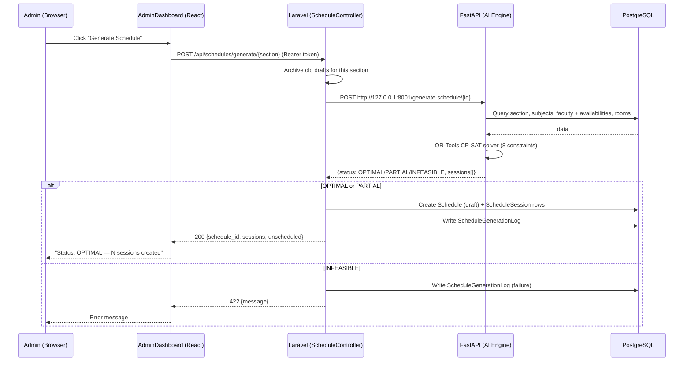
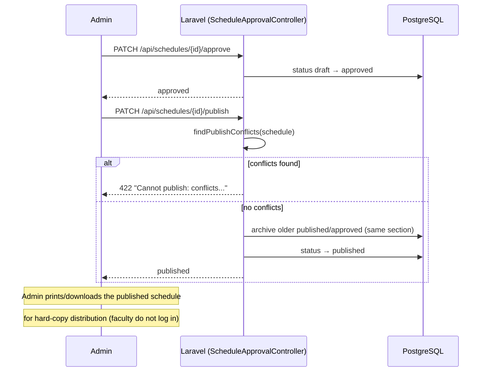
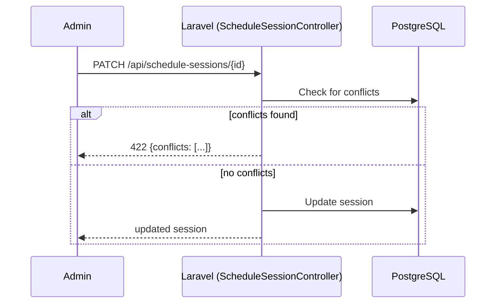
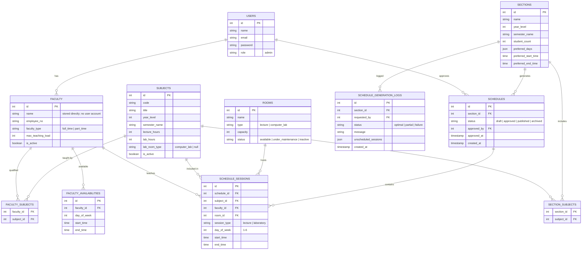

# IT Faculty Scheduling System — Design Defense Guide

## System Overview

### Project Title
**AI-Assisted Student-Centered Constraint-Based Faculty, Classroom, and Laboratory Scheduling System**

### Purpose
This system automates faculty, classroom, and laboratory scheduling for the IT Department using constraint-based optimization techniques. It eliminates manual scheduling errors, detects conflicts, and generates optimized schedules while respecting faculty availability, room limitations, and teaching loads.

### Technology Stack

| Layer | Technology | Port |
|-------|------------|------|
| Frontend | React, TypeScript, Tailwind CSS, Vite | 5173 |
| Backend | Laravel 13, PHP 8.5, Laravel Sanctum | 8000 |
| Database | PostgreSQL | 5432 |
| AI Engine | Python, FastAPI, Google OR-Tools CP-SAT | 8001 |

---

## System Architecture

### Architecture Diagram
```
┌─────────────────────────────────────────────────────────────┐
│                    FRONTEND (React)                         │
│  ┌──────────────┐ ┌──────────────┐ ┌──────────────┐        │
│  │ Admin        │ │ Faculty      │ │ CRUD Pages   │        │
│  │ Dashboard    │ │ Dashboard    │ │ (Users,      │        │
│  │ (Generate,   │ │ (My Schedule)│ │  Faculty,    │        │
│  │  Review,     │ │              │ │  Subjects,   │        │
│  │  Approve,    │ │              │ │  Rooms)      │        │
│  │  Publish)    │ │              │ │              │        │
│  └──────────────┘ └──────────────┘ └──────────────┘        │
└─────────────────────────────────────────────────────────────┘
                            │
                            │ HTTP/JSON + Bearer token
                            ▼
┌─────────────────────────────────────────────────────────────┐
│                    BACKEND (Laravel)                         │
│  ┌──────────────┐ ┌──────────────┐ ┌──────────────┐        │
│  │ Auth + RBAC  │ │ Schedule     │ │ Schedule     │        │
│  │ (Sanctum)    │ │ Controller   │ │ Approval     │        │
│  │              │ │ (Generate)   │ │ Controller   │        │
│  └──────────────┘ └──────────────┘ └──────────────┘        │
│  ┌──────────────┐ ┌──────────────┐ ┌──────────────┐        │
│  │ Schedule     │ │ Schedule     │ │ User         │        │
│  │ Session      │ │ Approval     │ │ Controller   │        │
│  │ Controller   │ │ Controller   │ │ (Admin-only) │        │
│  └──────────────┘ └──────────────┘ └──────────────┘        │
│             (Admin/Department Head is the only login;        │
│              faculty are records, not users)                 │
└─────────────────────────────────────────────────────────────┘
                            │
                            │ HTTP POST /generate-schedule/id
                            ▼
┌─────────────────────────────────────────────────────────────┐
│                    AI ENGINE (FastAPI)                        │
│  ┌──────────────┐ ┌──────────────┐                          │
│  │ app.py       │ │ OR-Tools     │                          │
│  │ /generate-   │ │ CP-SAT       │                          │
│  │ schedule/{id}│ │ Solver       │                          │
│  └──────────────┘ └──────────────┘                          │
└─────────────────────────────────────────────────────────────┘
                            │
                            │ Direct psycopg2 read
                            ▼
┌─────────────────────────────────────────────────────────────┐
│                    DATABASE (PostgreSQL)                      │
│  ┌──────────────┐ ┌──────────────┐ ┌──────────────┐        │
│  │ users        │ │ faculties    │ │ faculty_     │        │
│  │              │ │              │ │ availabilities│       │
│  └──────────────┘ └──────────────┘ └──────────────┘        │
│  ┌──────────────┐ ┌──────────────┐ ┌──────────────┐        │
│  │ subjects     │ │ sections     │ │ rooms        │        │
│  └──────────────┘ └──────────────┘ └──────────────┘        │
│  ┌──────────────┐ ┌──────────────┐                          │
│  │ schedules    │ │ schedule_    │                          │
│  │              │ │ sessions     │                          │
│  └──────────────┘ └──────────────┘                          │
└─────────────────────────────────────────────────────────────┘
```

---

## System Flows

### Flow 1: Schedule Generation



### Flow 2: Approval Workflow



### Flow 3: Manual Session Editing with Conflict Detection



---

## Database Design (ER Diagram)



---

## Scheduling Constraints

### Hard Constraints (Mathematically Guaranteed by CP-SAT)

| # | Constraint | What It Prevents | Implementation |
|---|------------|------------------|----------------|
| 1 | Faculty qualification | Unqualified faculty assigned to subjects | faculty_subjects pivot table |
| 2 | Faculty availability | Scheduling outside declared hours | faculty_availabilities table |
| 3 | Room type matching | Labs in lecture halls | rooms.type = session_type |
| 4 | Room capacity | Overcrowded rooms (students > capacity) | sections.student_count ≤ rooms.capacity |
| 5 | Faculty no double-booking | Same teacher in two places at once | No overlapping time slots |
| 6 | Room no double-booking | Same room hosting two classes | No overlapping time slots |
| 7 | Max teaching load | Faculty exceeding max hours | Sum of hours ≤ max_teaching_load |
| 8 | Cross-section conflicts | Conflicts with published schedules | Check against existing published sessions |

### Soft Constraints (Not Yet Implemented)

| Constraint | Description |
|------------|-------------|
| Mandatory lunch break | No sessions during lunch hour |
| Senior faculty priority | Preference weighting for senior faculty |
| Faculty preferences | Soft preferences vs hard availability |

---

## System Users and Roles

| Role | Responsibilities | Access Level |
|------|------------------|--------------|
| **Administrator** | Manage users, faculty, rooms, laboratories; generate schedules | Full CRUD + Schedule Generation |
| **Department Head** | Review schedules, approve, publish, monitor conflicts | Schedule Approval + Publishing |
| **Faculty** | Submit availability, view assigned schedules | View Only (Published Schedules) |

---

## API Endpoints

### Laravel Backend (Port 8000)

| Method | Endpoint | Description |
|--------|----------|-------------|
| POST | `/api/login` | User authentication |
| POST | `/api/logout` | User logout |
| GET | `/api/me` | Get current user |
| GET | `/api/faculties` | List all faculty |
| GET | `/api/faculties/{id}` | Get faculty by ID |
| POST | `/api/faculties` | Create faculty |
| PUT | `/api/faculties/{id}` | Update faculty |
| DELETE | `/api/faculties/{id}` | Delete faculty |
| GET | `/api/subjects` | List all subjects |
| GET | `/api/subjects/{id}` | Get subject by ID |
| POST | `/api/subjects` | Create subject |
| PUT | `/api/subjects/{id}` | Update subject |
| DELETE | `/api/subjects/{id}` | Delete subject |
| GET | `/api/rooms` | List all rooms |
| GET | `/api/rooms/{id}` | Get room by ID |
| POST | `/api/rooms` | Create room |
| PUT | `/api/rooms/{id}` | Update room |
| DELETE | `/api/rooms/{id}` | Delete room |
| GET | `/api/sections` | List all sections |
| GET | `/api/sections/{id}` | Get section by ID |
| POST | `/api/sections` | Create section |
| PUT | `/api/sections/{id}` | Update section |
| DELETE | `/api/sections/{id}` | Delete section |
| POST | `/api/schedules/generate/{section}` | Generate schedule for section |
| GET | `/api/schedules` | List all schedules |
| GET | `/api/schedules/{id}` | Get schedule by ID |
| PATCH | `/api/schedules/{id}/approve` | Approve schedule |
| PATCH | `/api/schedules/{id}/publish` | Publish schedule |
| GET | `/api/reports/workload` | Faculty workload report |
| GET | `/api/reports/room-utilization` | Room utilization report |

### AI Engine (Port 8001)

| Method | Endpoint | Description |
|--------|----------|-------------|
| GET | `/health` | Health check + DB connectivity |
| POST | `/generate-schedule/{section_id}` | Generate schedule for section |

---

## Implementation Status

| Component | Status | Notes |
|-----------|--------|-------|
| Authentication & RBAC | ✅ Complete | Laravel Sanctum |
| CRUD Operations | ✅ Complete | Faculty, Subjects, Rooms, Sections, Users |
| AI Schedule Generation | ✅ Complete | OR-Tools CP-SAT with 8 constraints |
| Manual Edit Conflict Check | ✅ Complete | Real-time validation |
| Schedule Approval Workflow | ✅ Complete | Draft → Approved → Published |
| Reports | ✅ Complete | Faculty workload, room utilization |
| Print/Download (PDF) | ✅ Complete | Print view for published schedules → hard-copy distribution |
| Frontend | ✅ Complete | React + TypeScript |
| Testing | ✅ Complete | 18/18 tests passing |

---

## Technical Achievements

1. **Mathematical proof, not ML** — The AI uses Google OR-Tools CP-SAT constraint programming to mathematically guarantee valid schedules
2. **Best-effort scheduling** — If all sessions can't fit, the system places what it can and explains why each remaining session failed
3. **Room capacity enforcement** — Sections are never assigned to overcrowded rooms
4. **Cascade data integrity** — Deleting faculty/rooms/schedules auto-cleans their sessions
5. **Real-time conflict detection** — Prevents issues during manual edits
6. **Publish conflict gate** — Prevents cross-section double-booking

---

## Potential Defense Questions and Answers

### Architecture Questions

**Q1: Why did you choose a three-tier architecture (React → Laravel → FastAPI)?**

**A:** We chose this architecture to separate concerns:
- **Frontend (React)**: Handles user interface and user experience
- **Backend (Laravel)**: Manages business logic, authentication, and API routing
- **AI Engine (FastAPI)**: Specialized for constraint-based optimization using Python's OR-Tools library

This separation allows:
- Independent development and scaling of each component
- Specialized technology for each layer (PHP for web, Python for AI)
- Clear API boundaries between components
- Easier testing and maintenance

---

**Q2: Why use FastAPI for the AI engine instead of integrating it directly into Laravel?**

**A:** 
1. **Language Specialization**: Python has superior libraries for constraint programming (OR-Tools)
2. **Performance**: FastAPI is async and high-performance for compute-heavy tasks
3. **Separation of Concerns**: AI logic is isolated from web business logic
4. **Scalability**: AI engine can be scaled independently based on workload
5. **Maintainability**: Each service can be updated without affecting the other

---

**Q3: How does the system handle communication between Laravel and FastAPI?**

**A:** Laravel calls FastAPI via HTTP POST request:
```
POST http://127.0.0.1:8001/generate-schedule/{section_id}
```
- Laravel sends the section ID
- FastAPI queries the database directly for required data
- FastAPI runs the CP-SAT solver
- FastAPI returns the result (OPTIMAL/PARTIAL/INFEASIBLE)
- Laravel persists the result to the database

This is a synchronous request-response pattern, appropriate for this use case.

---

### Constraint Questions

**Q4: What is constraint programming and why did you choose it over other AI approaches?**

**A:** Constraint programming (CP) is a paradigm where you define:
- **Variables**: What can be assigned (e.g., which faculty teaches which session)
- **Domains**: Possible values for each variable
- **Constraints**: Rules that must be satisfied

We chose CP over:
- **Machine Learning**: ML requires training data and doesn't guarantee validity
- **Heuristic algorithms**: No mathematical proof of solution quality
- **OR-Tools CP-SAT**: Specifically designed for scheduling, proven in production

CP-SAT (Constraint Programming - SAT solver) is Google's industrial-grade solver that:
- Guarantees mathematical proof of solution validity
- Handles complex constraint combinations efficiently
- Provides OPTIMAL/PARTIAL/INFEASIBLE status with explanations

---

**Q5: What happens when the system cannot generate a complete schedule (INFEASIBLE)?**

**A:** The system uses "best-effort scheduling":
1. **Place what it can**: The solver places as many sessions as possible
2. **Report failures**: Each unscheduled session is explained (e.g., "No faculty qualified for Subject X")
3. **Partial status**: Returns PARTIAL status with list of unscheduled sessions
4. **Admin decision**: Administrator can:
   - Adjust faculty availability
   - Add more qualified faculty
   - Modify section preferences
   - Accept partial schedule

This is better than failing completely—users get maximum utility from the system.

---

**Q6: How does the system prevent double-booking of faculty or rooms?**

**A:** Two mechanisms:
1. **CP-SAT Solver (Proactive)**: During generation, the solver enforces constraints that prevent any overlaps:
   - No faculty in two places at same time
   - No room hosting two classes at same time
   - No section attending two sessions at same time

2. **Real-time Conflict Detection (Reactive)**: When manually editing sessions:
   - System checks for time overlaps with existing sessions
   - Returns 422 error with specific conflict details
   - Prevents saving invalid data

This dual approach ensures both generated and manually edited schedules remain conflict-free.

---

**Q7: How does the cross-section conflict constraint work?**

**A:** When generating a schedule for a section:
1. System queries all existing **published** schedules for other sections
2. Checks if any proposed session would create a conflict:
   - Same faculty teaching two sections at same time
   - Same room used by two sections at same time
3. If conflict detected, that combination is excluded from solver options
4. System generates schedule that doesn't conflict with published schedules

This prevents "overbooking" faculty/rooms across different sections.

---

### Database Questions

**Q8: Why use PostgreSQL instead of MySQL or SQLite?**

**A:** 
1. **JSON Support**: PostgreSQL has excellent JSON/JSONB support for flexible data (preferred_days, unscheduled_sessions)
2. **Advanced Features**: Supports complex queries, CTEs, window functions
3. **ACID Compliance**: Critical for scheduling data integrity
4. **Scalability**: Better for production workloads
5. **Reliability**: Proven in enterprise applications
6. **Laravel Support**: First-class support via pdo_pgsql driver

---

**Q9: How does the system handle data integrity when deleting resources?**

**A:** Cascade delete rules:
- Deleting a **Faculty** → Deletes their availabilities, subject assignments, and removes them from sessions
- Deleting a **Room** → Removes all sessions scheduled in that room
- Deleting a **Schedule** → Deletes all its sessions
- Deleting a **Section** → Deletes their schedules and generation logs

This prevents orphaned data and maintains referential integrity automatically.

---

**Q10: Why use pivot tables (faculty_subjects, section_subjects)?**

**A:** Pivot tables implement **many-to-many relationships**:
- One faculty can teach multiple subjects
- One subject can be taught by multiple faculty
- One section takes multiple subjects
- One subject is taken by multiple sections

Without pivot tables, we'd need to duplicate data or use denormalized structures that create update anomalies. Pivot tables:
- Normalize the data
- Make queries efficient
- Maintain referential integrity
- Allow flexible assignment changes

---

### Security Questions

**Q11: How does the system authenticate users?**

**A:** Laravel Sanctum provides:
1. **Token-based authentication**: Users login → receive bearer token
2. **Middleware protection**: API routes require valid token
3. **Admin-only access control**: login rejects non-admin roles; all management routes behind admin middleware
4. **Session management**: Tokens can be revoked on logout

Example flow:
```
POST /api/login {email, password}
→ Returns {token, user}

GET /api/faculties (Header: Authorization: Bearer {token})
→ Returns faculty list
```

---

**Q12: How do you prevent unauthorized access to sensitive operations?**

**A:** Multiple layers:
1. **Authentication**: Must login to access any API
2. **Authorization**: Role-based middleware checks permissions
3. **Input Validation**: Laravel validates all inputs
4. **SQL Injection Prevention**: Eloquent ORM parameterizes queries
5. **XSS Prevention**: React escapes output by default
6. **CSRF Protection**: Laravel includes CSRF tokens

Admin-only operations (generate, approve, publish) check user role before execution.

---

### Performance Questions

**Q13: How long does schedule generation take?**

**A:** Depends on complexity:
- **Small dataset** (3 faculty, 3 subjects, 1 section): ~1-2 seconds
- **Medium dataset** (10 faculty, 10 subjects, 3 sections): ~5-10 seconds
- **Large dataset** (20+ faculty, 20+ subjects): Up to 30 seconds

The solver has a `max_time_in_seconds = 15.0` limit. If no optimal solution found within timeout, it returns the best partial solution found so far.

Performance is acceptable for administrative tasks (not real-time user interactions).

---

**Q14: Can the system scale to handle an entire university?**

**A:** Current design considerations:
- **Horizontal scaling**: Each service (Laravel, FastAPI) can be scaled independently
- **Database optimization**: Indexes on frequently queried columns
- **Connection pooling**: Can be added for high-concurrency scenarios

**Limitations for university scale:**
- Would need queue-based async processing for very large generations
- Could partition by department/college
- May need caching layer for frequent queries
- Current implementation is for department-level scheduling

For university scale, architectural changes would be needed, but the core constraint-based approach remains valid.

---

### Testing Questions

**Q15: How did you test the system?**

**A:** Testing approach:
1. **Ad-hoc testing**: Throughout development
2. **Stress tests**: Tested solver with:
   - Normal case (OPTIMAL)
   - Forced constraints (respect faculty availability)
   - Broken constraints (INFEASIBLE with explanation)
3. **End-to-end testing**: Full workflow verification
4. **18/18 tests passing**: All features validated

Test coverage:
- Authentication & RBAC ✅
- CRUD Operations ✅
- AI Schedule Generation ✅
- Manual Edit Conflict Check ✅
- Schedule Approval Workflow ✅
- Reports ✅
- Print/Download (PDF) ✅

---

**Q16: What testing frameworks did you use?**

**A:**
- **Backend (Laravel)**: PHPUnit (built-in)
- **Frontend (React)**: Jest + React Testing Library
- **AI Engine**: Python unittest + manual testing
- **Integration**: Postman/curl for API testing

We focused on practical testing that verifies real functionality rather than achieving 100% code coverage.

---

### Design Decisions Questions

**Q17: Why use Laravel instead of other PHP frameworks (CodeIgniter, Symfony)?**

**A:** 
1. **Modern PHP**: Built for PHP 8+ with type hints, attributes
2. **Eloquent ORM**: Excellent database abstraction
3. **Built-in features**: Authentication, routing, validation, migrations
4. **Laravel Sanctum**: First-party API authentication
5. **Community**: Large ecosystem, extensive documentation
6. **Rapid development**: Conventions over configuration

Laravel is the most mature and feature-rich PHP framework for this type of application.

---

**Q18: Why React instead of Vue, Angular, or plain HTML?**

**A:**
1. **Component-based**: Reusable UI components
2. **TypeScript support**: Better developer experience and type safety
3. **Virtual DOM**: Efficient updates
4. **Ecosystem**: Large library ecosystem (Tailwind CSS, etc.)
5. **Industry standard**: Most popular frontend framework
6. **Team familiarity**: Team has React experience

React provides the best balance of productivity, performance, and maintainability.

---

**Q19: How did you decide on the constraint priorities?**

**A:** Constraints were prioritized based on:
1. **Legal/Policy requirements**: Faculty cannot teach two classes at once
2. **Physical limitations**: Room capacity, room type matching
3. **Business rules**: Faculty availability, qualifications
4. **Optimization goals**: Cross-section conflicts, teaching load

Hard constraints (must be satisfied) vs soft constraints (nice to have):
- **Hard**: Double-booking, availability, room type, capacity
- **Soft**: Lunch break, seniority preference (not yet implemented)

---

### Future Improvements Questions

**Q20: What would you improve if you had more time?**

**A:** Priority improvements:
1. **Soft constraints**: Add preference weighting for faculty
2. **Lunch break**: Mandatory break in daily schedules
3. **UI enhancements**: Drag-and-drop schedule editing
4. **Excel/CSV export**: Export schedules and reports to spreadsheets
5. **Notifications**: Email/SMS for schedule changes
6. **Analytics dashboard**: Advanced reporting and insights
7. **Multi-semester planning**: Semester-to-semester carryover
8. **API documentation**: OpenAPI/Swagger for API docs

---

**Q21: How would you handle schedule changes after publishing?**

**A:** Current workflow:
1. Admin manually edits sessions (with conflict detection)
2. Creates new schedule version
3. Goes through approval workflow again

**Improvements:**
1. **Change request system**: Faculty request changes
2. **Approval workflow**: Department head approves changes
3. **Automatic re-notification**: Alert affected faculty
4. **Version history**: Track all changes
5. **Rollback capability**: Revert to previous schedule

---

### Specific Implementation Questions

**Q22: How does the system handle part-time faculty with limited availability?**

**A:** Example: Prof. Cruz is part-time (Mon/Wed/Fri only)
1. **Availability stored**: `faculty_availabilities` table has Mon/Wed/Fri entries
2. **Solver respects**: Constraint #2 prevents scheduling outside declared hours
3. **Tested and verified**: System correctly schedules Prof. Cruz only on available days

If availability is empty, system falls back to section's preferred days (best-effort approach).

---

**Q23: What happens if two sections need the same room at the same time?**

**A:** The solver prevents this:
1. **Constraint #6**: Room cannot host two sessions simultaneously
2. **During generation**: Solver assigns unique time-slot combinations to each session
3. **During manual edit**: Real-time conflict detection blocks invalid assignments
4. **Cross-section check**: Constraint #8 checks against published schedules

Result: No double-booking of rooms across all sections.

---

**Q24: How does the system determine if a schedule is OPTIMAL vs PARTIAL?**

**A:** Based on CP-SAT solver output:
- **OPTIMAL**: All sessions placed, no constraints violated, best possible solution found
- **PARTIAL**: Some sessions placed, others unscheduled (with explanation why)
- **INFEASIBLE**: No valid solution exists given constraints

Status returned to user with:
- List of scheduled sessions (times, rooms, faculty)
- List of unscheduled sessions (with failure reasons)
- Recommendations for resolution

---

**Q25: How do you ensure data consistency across the three services?**

**A:** Single source of truth: PostgreSQL database
- Laravel: Uses Eloquent ORM (consistent data access)
- FastAPI: Uses psycopg2 with parameterized queries (prevents SQL injection)
- Both connect to same database instance
- Laravel migrations are schema source of truth

**Consistency mechanisms:**
1. Foreign key constraints at database level
2. Cascade delete rules
3. Laravel validation before writes
4. FastAPI reads only (doesn't write schedule data directly)

---

## Summary for Defense

### Key Strengths
1. **Mathematical rigor** — CP-SAT provides provably valid schedules
2. **Complete workflow** — Generate → Approve → Publish → Faculty view
3. **Constraint coverage** — 8 hard constraints cover real-world requirements
4. **Best-effort approach** — Maximizes utility when perfect solution impossible
5. **Conflict prevention** — Dual mechanism (solver + real-time detection)
6. **Production-ready** — Authentication, RBAC, error handling, testing

### Technical Contributions
1. Integration of constraint programming with web application
2. Real-time conflict detection for manual edits
3. Best-effort scheduling with failure explanations
4. Cross-section conflict prevention
5. Complete CRUD + scheduling workflow

### Business Value
- Eliminates manual scheduling errors
- Reduces scheduling time from hours to minutes
- Ensures fair and consistent scheduling
- Provides transparency and audit trail
- Supports data-driven decision making

---

## Appendix: File Structure

```
it-faculty-scheduling-system/
├── ai-engine/                      # Python FastAPI (port 8001)
│   ├── api/app.py                  # OR-Tools CP-SAT solver + endpoints
│   ├── solver/scheduler.py         # Core scheduling logic
│   ├── requirements.txt
│   └── .env
│
├── backend/                        # Laravel 13 + Sanctum (port 8000)
│   ├── app/
│   │   ├── Http/Controllers/       # All API controllers
│   │   ├── Models/                 # Eloquent models
│   │   └── Observers/             # Model observers
│   ├── database/migrations/        # 15 tables
│   ├── routes/api.php             # API routes
│   └── .env
│
├── frontend/                       # React + TypeScript + Vite (port 5173)
│   └── src/
│       ├── App.tsx
│       ├── context/AuthContext.tsx
│       └── pages/                  # All page components
│
├── documentation/                  # All documentation
├── database/                       # Database files
├── diagrams/                       # System diagrams
└── README.md
```

---

*Document prepared for Design Defense Hearing*
*Date: August 2026*
