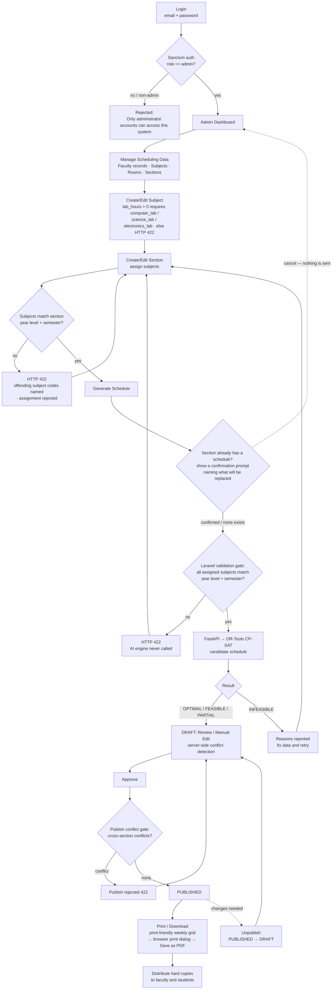

# User Flow — IT Faculty Scheduling System

*Standalone companion to `System-Architecture.md` § 3 (User Types and User Flows). Content is identical and verified against the implemented system (commit 38274e3).*

---

## 1. System Users (Complete List)

| User Type | System Access | Role in the System |
|---|---|---|
| **Administrator / Department Head** | **Login account — the only system user** (one combined role; the Department Head logs in with the Administrator account) | Full operational control: manage faculty/subject/room/section records, generate schedules, review/edit, approve, publish, unpublish, print/download, view reports, manage admin accounts |
| **Faculty** | **No login — not a system user** | Maintained as scheduling records (name, employment type, qualifications, availability, max load). Their data feeds the scheduling engine; they receive published schedules as **printed/PDF copies** |
| **Students** | **No login — not a system user** | Recipients of published schedules via printed/PDF copies posted or distributed by the department |

> **Role-model note:** The SRS lists *Administrator* and *Department Head* as two user classes; the implemented system issues a single **admin** login role that covers both (the Department Head uses the Administrator account). There is no faculty login, no faculty portal, and no student account. Faculty and students exist only as data records / recipients.

---

## 2. User Flow — Administrator / Department Head



Text flow (same steps):

```text
Login (admin-only) → Manage Data → Create/Edit Subjects (lab consistency validated)
  → Create/Edit Sections + Assign Subjects (year/semester validated, 422 on mismatch)
  → Generate Schedule (if the section already has a schedule, confirm before replacing it — cancelling sends nothing)
  → Laravel validation gate (422 blocks legacy mismatches; AI never called)
  → OR-Tools CP-SAT candidate → DRAFT → Review / Manual Edit (conflict-checked)
  → Approve → Publish conflict gate → PUBLISHED → Print/Download PDF → Distribute
  → (Unpublish returns to DRAFT for re-editing)
```

Every validation step above is enforced server-side (SectionController, SubjectController, ScheduleController) and mirrored in the UI — the subject checklist on the Sections page only lists subjects matching the section's year level and semester, with legacy mismatches flagged in place.

---

## 3. User Flow — Faculty (Non-User)

Faculty never log in and never interact with the system directly:

```text
Admin enters faculty data (name, type, qualifications, availability, max load)
  → faculty records feed the scheduling engine
  → Admin publishes the schedule
  → Admin prints / exports PDF
  → faculty member receives the printed/PDF copy of their schedule
```

---

## 4. User Flow — Students (Non-User)

Students never log in and never interact with the system directly:

```text
Admin publishes the section schedule
  → Admin prints / exports PDF
  → copies are posted or distributed to the class
```

---

## 5. Schedule Lifecycle (status transitions)

```text
DRAFT → APPROVED → PUBLISHED → ARCHIVED
                     ↓ (Unpublish)
                  DRAFT (for re-editing)
```

- **DRAFT** — AI-generated candidate; can be reviewed and manually edited (every edit conflict-checked server-side)
- **APPROVED** — accepted by the Admin/Department Head; still not visible to faculty/students
- **PUBLISHED** — passed the cross-section publish conflict gate; printed/PDF copies are produced for distribution
- **ARCHIVED** — superseded by a newer generation for the same section
